# DataAgent 企业数据分析平台 — 产品使用手册

> **版本**: v1.1 · **适用版本**: MVP Release
>
> 本手册面向终端用户（业务人员、数据分析师、管理员、审计员），介绍 DataAgent 的功能与日常使用方法。
>
> 本文档仅描述已实现的功能，不涉及任何技术实现细节与敏感信息。所有界面截图均来自 GitHub Actions UI 测试的实景渲染。

---

## 目录

1. [产品概览](#1-产品概览)
2. [登录与界面导览](#2-登录与界面导览)
3. [Chat 对话：即时数据查询](#3-chat-对话即时数据查询)
4. [Agent 任务：批量分析](#4-agent-任务批量分析)
5. [Hermes 探索：自由对话模式](#5-hermes-探索自由对话模式)
6. [知识库：让 AI 引用你的资料](#6-知识库让-ai-引用你的资料)
7. [文档](#7-文档)
8. [仪表盘：数据看板](#8-仪表盘数据看板)
9. [管理后台（管理员专用）](#9-管理后台管理员专用)
10. [飞书机器人：IM 渠道使用](#10-飞书机器人im-渠道使用)
11. [常见问题](#11-常见问题)

---

## 1. 产品概览

### 1.1 什么是 DataAgent

DataAgent 是一款企业级智能数据分析平台。它让你**用自然语言和你的业务数据对话**——不用写 SQL、不用跑脚本，直接在对话框里说出你的问题，系统会自动理解意图、生成查询、执行分析并给出可读的结论与图表。

不同角色的员工都能从中受益：

- **一线业务人员** — 快速查询数据，一两句话得到答案
- **数据分析师** — 发起复杂的批量分析任务
- **管理员** — 配置系统、管理用户、查看整体运行情况
- **审计员** — 查看所有操作记录，保证合规

### 1.2 平台导航

登录后，**左侧导航栏**按页面功能组织，可分为四类：

| 类别 | 页面 | 主要能力 |
|------|------|---------|
| **个人入口** | 仪表盘 | 个人活动概览、待办、近期分析 |
| **核心使用** | Chat 对话 / Hermes 探索 / Agent 任务 | 自然语言查询、自由探索、批量分析 |
| **内容管理** | 知识库 / 文档 | 文档上传、索引、搜索与浏览 |
| **系统管理**（仅管理员可见） | 管理后台 | 用户、权限、模型、任务、看板、审计 |

不同的角色看到的导航项略有不同——普通用户看不到"管理后台"。

### 1.3 角色与能力一览

| 角色 | 仪表盘 | Chat | Hermes | Agent 任务 | 知识库 | 文档 | 管理后台 |
|------|:---:|:---:|:---:|:---:|:---:|:---:|:---:|
| 普通用户 | ✅ | ✅ | ✅ | — | ✅ | ✅ | — |
| 数据分析师 | ✅ | ✅ | ✅ | ✅ | ✅ | ✅ | — |
| 知识管理员 | ✅ | ✅ | ✅ | — | ✅ | ✅ | 知识库部分 |
| 系统管理员 | ✅ | ✅ | ✅ | ✅ | ✅ | ✅ | 全部 |
| 审计员 | ✅ | — | — | — | — | — | 审计部分（只读） |

---

## 2. 登录与界面导览

### 2.1 登录系统

打开浏览器访问 DataAgent 地址，登录页面提供两种方式：

- **邮箱 + 密码登录**：使用系统分配的邮箱和密码登录
- **企业 SSO 单点登录**：通过企业统一身份认证登录

> **小贴士**
> - 首次部署后，系统管理员账号会在系统日志中输出一段随机生成的初始密码，请登录后立即修改
> - 顶部如果出现"修改初始密码"提示，请按引导尽快修改

### 2.2 主界面布局

登录成功后进入主界面。整体由三部分组成：

- **左侧导航栏**：在平台各功能页之间切换
- **顶部标题栏**：当前页面标题、操作按钮，右上角有铃铛通知图标
- **主内容区**：当前页面的功能内容

---

## 3. Chat 对话：即时数据查询

Chat 对话是大多数人每天都会用到的主入口。核心是一个**对话式**聊天框：你提问，系统回答。

### 3.1 进入与提问

点击左侧 **Chat 对话** 进入。默认进入**分析模式**（与 DataAgent 自身的分析引擎对话）。

**主界面元素**

- **顶部模式切换**：分析模式 / 探索模式（详见第 5 章）
- **右上角状态**：在线状态、新对话按钮、会话设置
- **空状态提示**：欢迎气泡 + 输入提示
- **快捷提示词行**：4 个常用查询模板
  - 今日数据概览
  - 本月销售趋势
  - 同比环比分析
  - TOP10 产品
- **底部输入框**：写下你的问题 + 工具词/增强按钮 + 发送按钮

**使用方式**

1. 在输入框中直接输入自然语言，例如：
   - "昨天华东区的销售额是多少？"
   - "本月销售趋势如何？"
   - "对比一下 Q1 和 Q2 的客户增长"
2. 按 **回车键** 或点击发送按钮发送问题
3. 系统会显示加载状态（"查询中…"、"计算中…"），完成后展示结果

### 3.2 快捷提示词

如果不知道该怎么提问，或者想要一键启动常见分析，可以直接点击**快捷提示词标签**：

- 今日数据概览
- 本月销售趋势
- 同比环比分析
- TOP10 产品

点击后系统会立即按对应模板开始分析。

### 3.3 增强提示词（✨ AI 增强）

当你对要问什么比较模糊时，可以使用"增强提示词"功能让 AI 帮你把简短问题**扩展成更精确、更完整的分析需求**。

**使用步骤**

1. 在输入框中先写一段简短的描述，例如：「看看这个月的销售」
2. 点击输入框右侧的 **✨ AI 增强** 按钮
3. 系统会显示加载圈，AI 将你的简短输入补全为更专业的分析描述
4. 增强结果直接填入输入框，你可以在此基础上继续修改或直接发送

**特点**

- 无状态、不记录对话历史、不影响你当前的会话
- 响应快（通常在数秒内完成）
- 不计入对话的 Token 用量统计

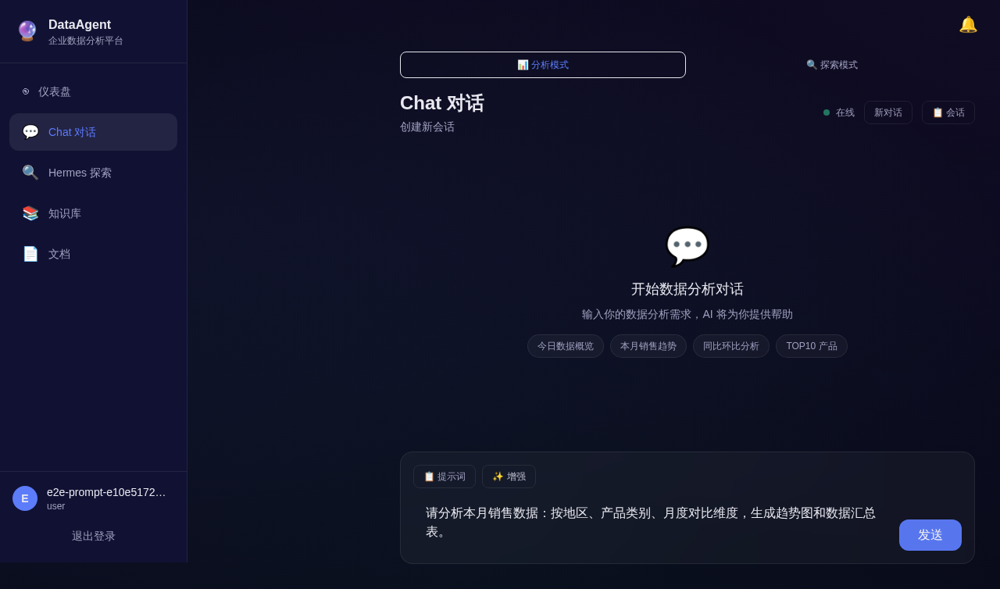

### 3.4 消息呈现：AI 是怎么回你的

系统对 AI 的回复做了大量美化渲染，让结果清晰易读：

- **工具调用卡片**：AI 调用查询、计算、文件下载等工具时，会以**折叠卡片**形式展示，展开可看到工具名、耗时、输入参数和输出摘要
- **SQL 代码块**：自动语法高亮，带「复制」按钮，你可以一键复制 SQL 用于其他场合
- **数据表格**：以斑马纹格式呈现，支持表头排序
- **数据图表**：直接在消息中内嵌渲染（不是单独的图片链接），可放大或下载
- **自然语言解读**：AI 会用通俗的话说明数据含义，重要数值加粗高亮
- **进度动画**：工具执行中会显示旋转动画和状态文字，例如「查询中…」「计算中…」「索引中…」

**SQL 代码块示例**

**数据表格示例**

**图表内嵌渲染示例**

### 3.5 会话历史管理

Chat 对话页右侧提供"历史会话"面板，自动保存你的所有对话。

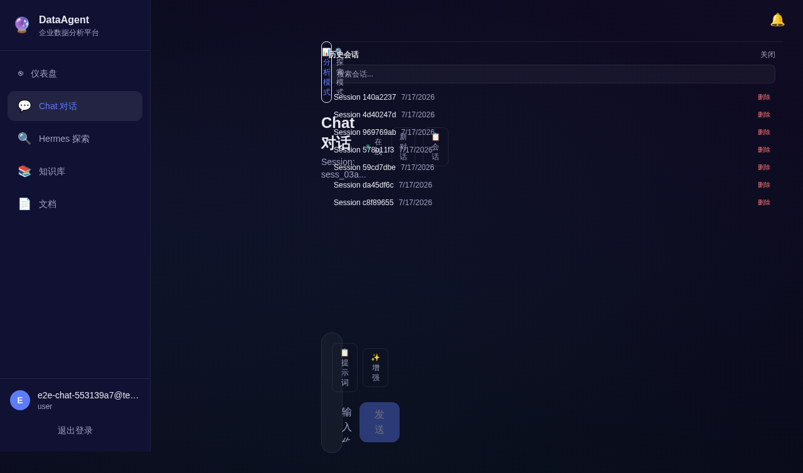每条会话显示：

- 会话标题（通常取自第一句问题）
- 消息数量
- 最后一次互动的时间

**操作**

- **点击某条会话** → 恢复完整对话上下文，可继续追问
- **搜索框** → 输入关键词快速找到历史会话
- **新对话按钮** → 开启全新的对话

> 会话在长时间不活动后会过期清理；重要的分析结果系统会自动保存，不受会话清理影响。

### 3.6 多轮追问

在同一个对话中，你可以在前一个问题的基础上继续追问。例如：

- 问：「华东区 Q2 销售额」
- 追问：「其中上海和杭州分别多少？」
- 再追问：「对比 Q1 增长了多少？列出 TOP5 客户」

系统会自动结合上下文理解你的问题，不需要重复背景。

---

## 4. Agent 任务：批量分析

当你的问题更复杂、需要更长时间计算、或者需要定期执行时，使用 **Agent 任务**。

### 4.1 任务列表

点击左侧 **Agent 任务** 进入任务管理列表。这里展示所有由你或团队发起的批量分析任务。

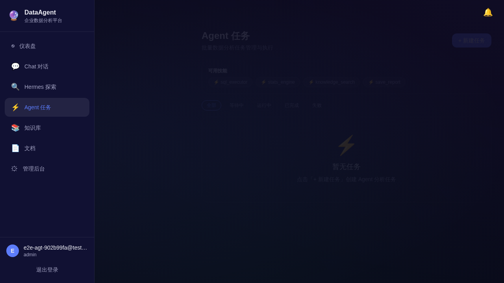

**页面元素**

- **页面标题**：Agent 任务 / 批量数据分析任务管理与执行
- **可用技能展示**：当前可用的工具能力标签，例如：
  - sql_executor（SQL 执行器）
  - stats_engine（统计分析引擎）
  - knowledge_search（知识库检索）
  - save_report（报告保存）
- **状态筛选标签**：全部 / 等待中 / 运行中 / 已完成 / 失败
- **任务列表**：每条任务显示
  - 任务名称
  - 状态 Pill（如 `queued`、`running`、`completed`、`failed`）
  - 创建时间
  - 操作按钮

**新建任务**：点击右上角 **+ 新建任务** 按钮。

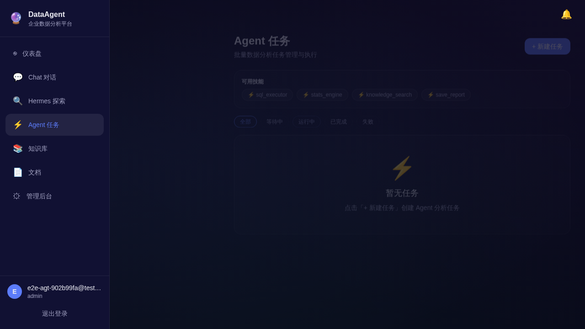

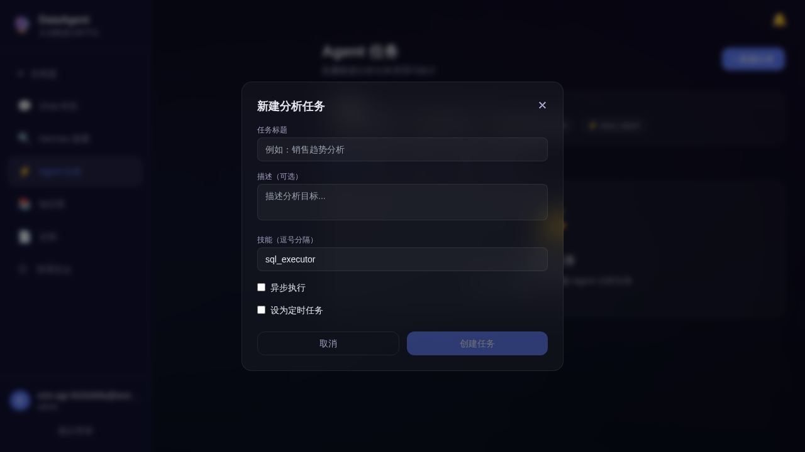

### 4.2 任务详情

任务详情从任务列表项**内联展开**（不在独立路由页面）。展开后可以看到：

- **任务进度条**：可视化进度
- **步骤指示器**：依次展示多步分析流程
- **执行日志**：按时间顺序展示每一步的详细日志
- **产出物列表**：任务执行过程中生成的图表、CSV 文件等
- **返回列表**：详情顶部提供「← 返回任务列表」按钮

**典型任务类型**

- SQL 统计分析
- 回归分析
- 时间序列分析
- 聚类分析（K-Means）
- 主成分分析（PCA）
- 财务比率分析

### 4.3 异步任务与通知

批量分析任务通常耗时较长，可以选择**异步执行**：

- 发起任务后立即返回任务 ID
- 系统在后台排队、执行
- 任务完成后通过**站内信 + 邮件**通知你

这意味着你不必一直盯着屏幕，可以去做其他工作。

### 4.4 定时任务

如果你希望某项分析**每天、每周或每月自动运行**，可以创建定时任务。例如：

- 每天早上 8 点生成前一天的销售日报
- 每周一上午生成上周经营分析周报
- 每月 1 号生成本月财务比率分析

> **支持范围**：每日、每周、每月的基础调度。
> **调度历史**：所有历史运行记录可追溯；失败时会通知任务负责人。

---

## 5. Hermes 探索：自由对话模式

在 **Chat 对话** 页面顶部，可以在 **分析模式** 和 **探索模式** 之间切换。

**两种模式的区别**

| 模式 | 后端 | 用途 |
|------|------|------|
| 分析模式 | DataAgent 自身 | 调用 MCP 工具进行数据查询、分析、知识库检索 |
| 探索模式 | Hermes（独立服务） | 自由探索式对话，可接入第三方模型或自定义服务 |

**什么时候用探索模式**

- 需要更发散的、探索性的对话
- 测试自定义的第三方模型
- 进行与数据分析无关的自由聊天

> **注意**：探索模式下 DataAgent 自身的数据分析工具不可用。如果你需要对数据进行分析，请切换到分析模式。

---

## 6. 知识库：让 AI 引用你的资料

知识库用于存放企业内部的文档（经营报告、市场策略、财务报表等），让 AI 在回答问题时能够**自动引用你的资料**，给出基于事实的解读。

### 6.1 文档上传

点击左侧 **知识库** 进入知识库管理页。

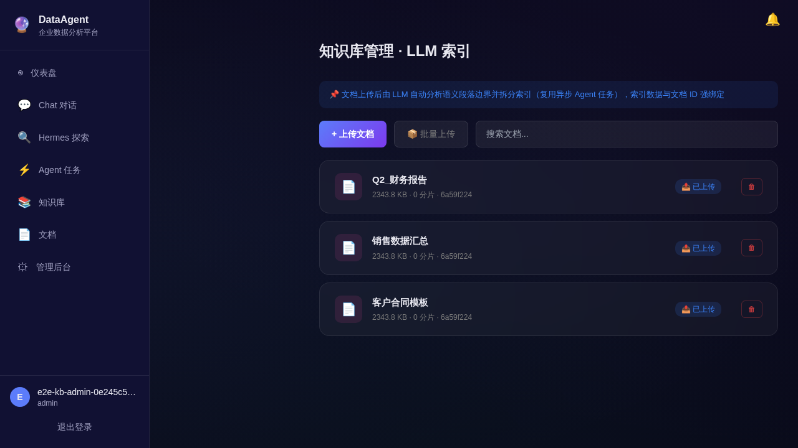

**页面元素**

- **页面标题**：知识库管理 · LLM 索引
- **索引说明条**：提示文档上传后由 LLM 自动分析语义段落边界并拆分索引
- **批量上传**：支持选择多个文件批量上传
- **文档卡片**：每条文档显示
  - 文件名
  - 文件大小、分片数、ID
  - 索引状态（已上传 / 索引中 / 索引完成 / 索引失败）
  - 删除按钮

**支持的文件格式**

- PDF
- Word (.docx)
- Excel (.xlsx)
- Markdown (.md)
- 纯文本 (.txt)

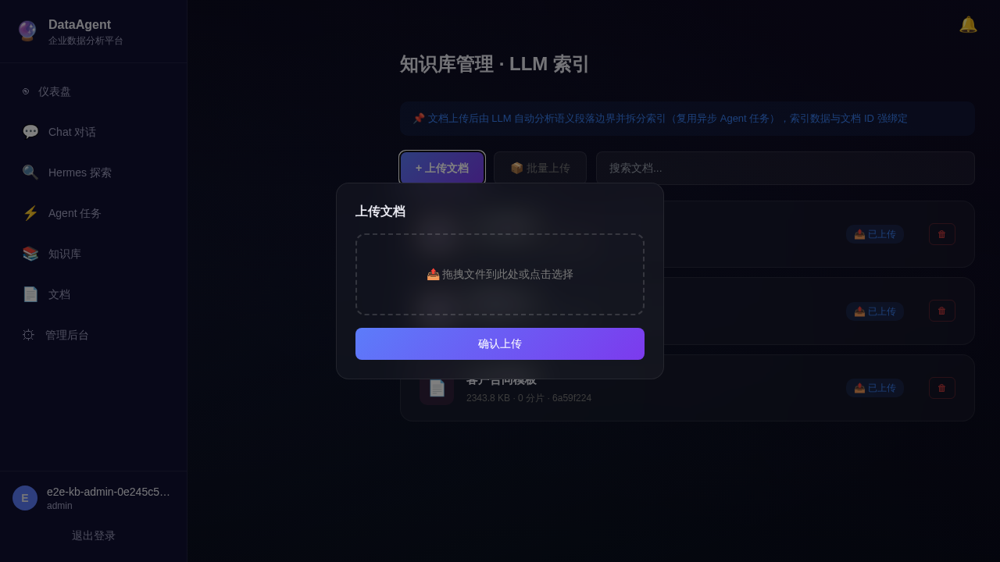

### 6.2 自动索引

文档上传后，系统会**自动**进行以下处理：

1. **文本解析**：从原文件中提取纯文本
2. **LLM 智能分片**：由大模型判断语义段落边界，把文档拆分为多个"内容块"（chunk）
3. **向量化索引**：为每个内容块生成语义向量，写入向量数据库
4. **可检索状态**：一旦索引完成，文档就可被搜索和引用

整个过程是**异步**的——上传后立即返回，不阻塞你的操作；后台任务执行时列表会显示"索引中"状态，完成后切换为"已索引"。

**索引状态说明**

- **已索引** — 文档可被搜索和引用
- **索引中** — 后台正在处理，请稍候
- **索引失败** — 处理遇到问题，可删除后重新上传，或联系管理员

### 6.3 搜索与引用

在 Chat 对话中，AI 会自动结合知识库中的相关文档来回答问题，例如：

- 你问：「上季度销售额下降的原因？」
- AI 检索到知识库里的「Q2 经营复盘报告.pdf」中相关章节
- 回答时自动附带解读："根据内部复盘报告，Q2 销售下滑主要由 X、Y 两个因素导致（来源：Q2 经营复盘报告.pdf）"

> 引用来源会**标注**在解读后面，让你知道信息出自哪里，方便追溯。

### 6.4 文档权限与标签

知识库文档支持标签、分类和基于角色的可见性设置：

- 标签用于主题归类（如"财务"、"市场"、"销售"）
- 可见性可按用户或角色配置——例如"财务报表"仅财务组可见
- 搜索结果会自动按用户权限过滤

---

## 7. 文档

左侧 **文档** 页面提供对系统所有可访问文档的集中浏览，包括知识库中的文档、Agent 任务生成的报告等。

文档页面支持：

- **列表浏览**：按时间、类型、来源筛选
- **预览**：在线查看常见格式（PDF、Markdown、纯文本）
- **下载**：保存到本地
- **搜索**：按名称、内容、标签检索

---

## 8. 仪表盘：数据看板

打开 DataAgent 默认进入**仪表盘**页面，提供系统运行的个人与全局概览。

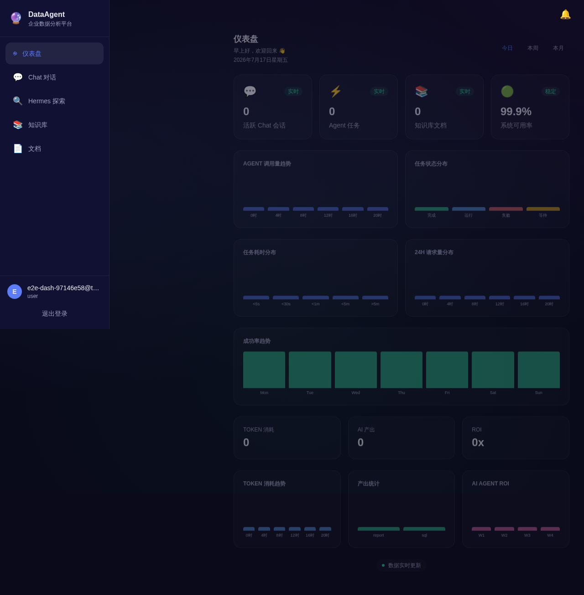

**页面元素**

- **欢迎语**：根据时间显示问候语
- **KPI 卡片**（4 个）
  - 活跃 Chat 会话
  - Agent 任务
  - 知识库文档
  - 系统可用率
- **可视化图表**
  - AGENT 调用量趋势
  - 任务状态分布
  - 任务耗时分布
  - 24h 请求量分布
  - 成功率趋势
- **成本与价值**
  - TOKEN 消耗
  - AI 产出
  - ROI
- **趋势图表**
  - TOKEN 消耗趋势
  - 产出统计
  - AI AGENT ROI

**时间筛选**：可切换"今日 / 本周 / 本月"。

---

## 9. 管理后台（管理员专用）

管理后台是系统管理员的"驾驶舱"，负责配置、监控、运维。**仅系统管理员或具有相应权限的角色可以访问。**

### 9.1 入口与导航

点击左侧 **管理后台** 进入。管理后台内部采用统一的二级导航，涵盖：

- 用户管理
- 权限管理
- 模型配置
- 任务管理
- 知识库管理（管理员视角）
- 审计日志
- API 转换审核
- 站内信
- 修改密码

### 9.2 用户管理

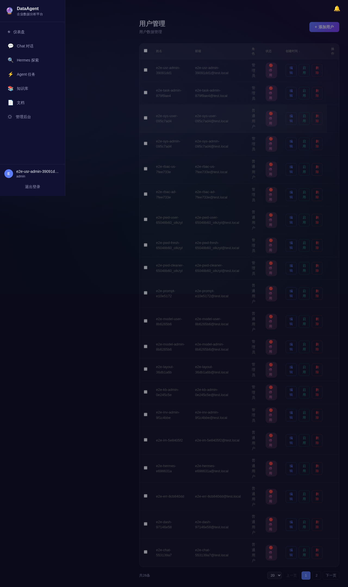

**可执行的操作**

- **添加用户**：填写姓名、邮箱、角色，创建账号
- **编辑用户**：修改姓名、邮箱、角色
- **启停账号**：禁用/启用账号（停用的账号无法登录）
- **删除用户**：删除不需要的账号（系统管理员不可删除）
- **批量操作**：通过复选框全选/取消全选

**角色说明**

- **系统管理员**：拥有全部权限，全平台唯一
- **数据分析师**：可使用 Chat / Agent 任务
- **知识管理员**：可管理知识库和 API 转换
- **普通用户**：仅可使用 Chat / 知识库

**表格列**：姓名 / 邮箱 / 角色 / 创建时间 / 状态 / 操作

### 9.3 权限管理

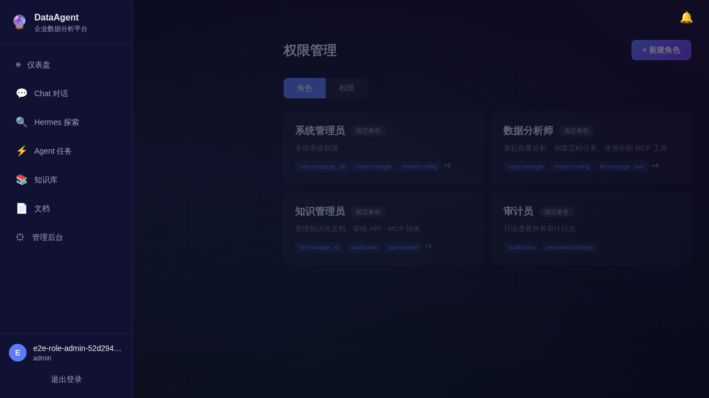

权限管理用于**定义角色**和**配置角色-权限映射**。

**两个 Tab**

- **角色 Tab**：查看所有固定角色和自定义角色
- **权限 Tab**：查看所有可分配的权限项

**内置固定角色**

- **系统管理员** — 全部系统权限
- **数据分析师** — 发起批量分析、创建定时任务、使用全部 MCP 工具
- **知识管理员** — 管理知识库文档、审核 API→MCP 转换
- **审计员** — 只读查看所有审计日志

> 普通用户无权访问此页面。

### 9.4 模型配置

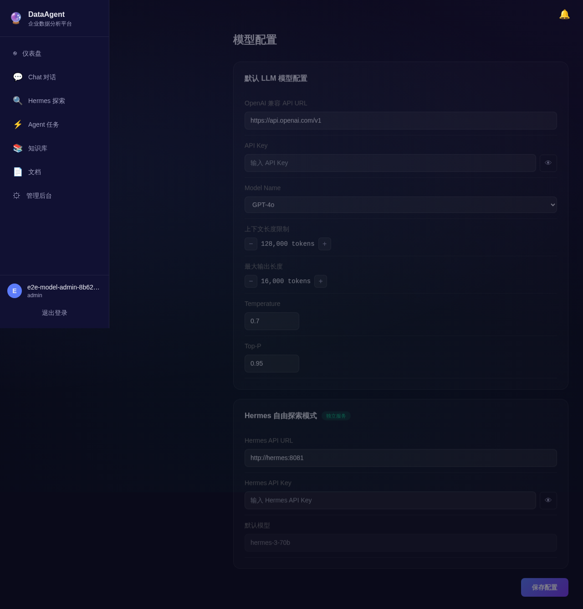

用于配置大模型（LLM）连接。系统支持任何兼容 OpenAI 接口规范的模型服务。

**默认 LLM 模型配置**

- **OpenAI 兼容 API URL**：模型服务地址
- **API Key**：访问凭证（已加密存储，界面默认掩码，可点击眼睛图标查看）
- **Model Name**：选用的模型，如 GPT-4o 等
- **上下文长度限制**：单次对话可用的最大 token 数（如 128,000）
- **最大输出长度**：单次回复最大 token 数（如 16,000）
- **Temperature**：控制回答的随机性
- **Top-P**：控制回答的多样性

**Hermes 自由探索模式配置**（独立区域）

- Hermes API URL
- Hermes API Key
- 默认模型

> 修改后会立即对所有用户生效，请谨慎调整。

### 9.5 任务管理

管理员可以在任务管理页面查看平台中**所有**用户的所有任务（不只是自己的），并执行取消、重试等操作。

**功能**

- 查看所有用户的任务
- 取消正在运行的任务
- 重试失败的任务
- 批量取消任务

### 9.6 知识库管理（管理员视角）

与普通用户看到的知识库页类似，但管理员可以：

- 查看所有用户上传的文档
- 删除任意文档
- 管理标签

### 9.7 审计日志

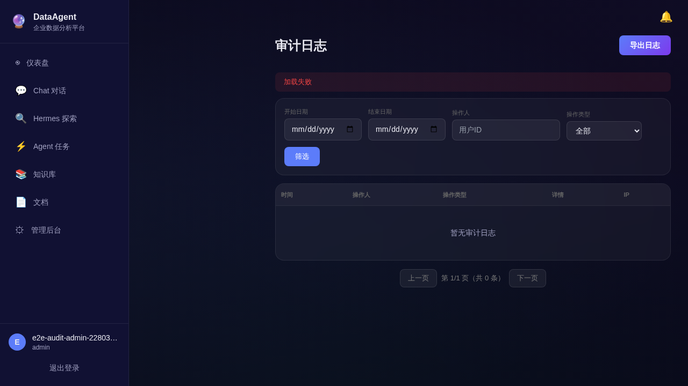

审计日志记录系统中**所有可追溯的操作**。

**记录内容**

| 类别 | 记录内容 |
|------|---------|
| 用户操作 | 谁在什么时间做了什么 |
| Agent 操作 | 哪个用户发起了哪个任务、调用了哪些工具、耗时多久 |
| 安全审计 | 越权拦截、敏感数据脱敏、异常输入/输出 |

**审计特点**

- 不可篡改、长期可追溯
- 支持按时间、操作人、操作类型筛选
- 支持按用户 ID 搜索
- 支持导出为审计报告
- 分页：默认 20 条/页，可切换 10/20/50/100

> 默认保留 90 天，可配置。

### 9.8 API 转换审核

把企业内部的 API（如 CRM、ERP 接口）转换为 AI 可调用的"工具"。

**流程**

1. 知识管理员上传 OpenAPI 3.0 规范的 JSON 或 YAML 文件
2. 系统自动解析 API 定义、生成工具描述
3. 卡片显示在审核列表中，状态为「待审核」
4. 由**另一位**管理员审批（不能自我审批）
5. 批准后，该 API 被转换为 AI 可调用的工具

**API 卡片信息**

- API 名称
- OpenAPI 规范版本、端点数、ID
- 上传时间
- 域名、调用频率限制
- 状态（待审核 / 已批准 / 已驳回）

**审核要点**

- API 域名是否可信（仅企业内网或可信外部域名）
- 是否有敏感数据传输
- 是否设置了合理的调用频率限制

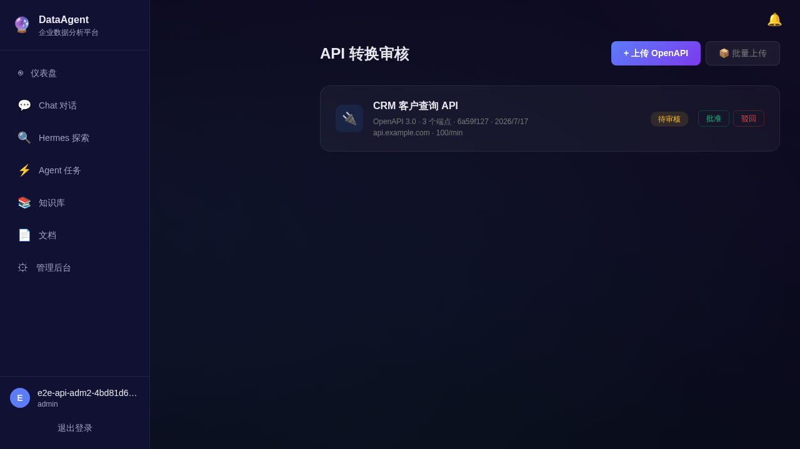

### 9.9 站内信

系统内部的用户之间消息通知。

- **互发**：点对点发送，无数量限制
- **群发**：选择多个接收人发送，每发送人每日上限 50 条
- **全站发送**（仅系统管理员）：发布到通知列表，不产生大量独立消息

**接收**

- 顶部铃铛图标 + 未读数红点

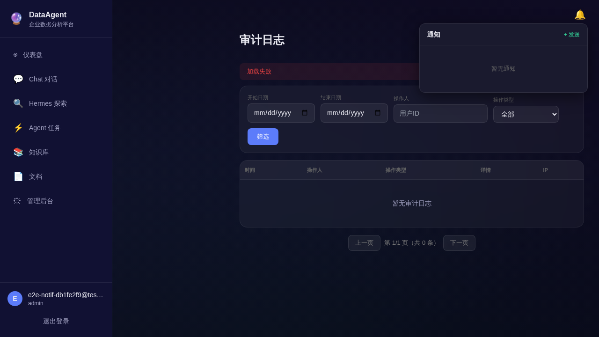
- 点击展开通知列表
- 未读/已读状态自动切换
- 一键全部已读
- 默认 90 天后自动清理

### 9.10 修改密码

所有角色都可以在管理后台修改自己的密码：

- 进入用户菜单 → 修改密码
- 输入当前密码 + 新密码（两次确认）
- 新密码强度需满足安全要求

> 如果忘记密码，请联系系统管理员重置。

---

## 10. 飞书机器人：IM 渠道使用

除了 Web 端，DataAgent 还支持在**飞书**中通过机器人使用数据查询和分析能力，无需打开浏览器。

### 10.1 绑定账号（首次使用）

首次在飞书中 @机器人 时，机器人会发送一张引导卡片：

1. 点击卡片中的"绑定账号"
2. 跳转至系统 Web 端的绑定页
3. 输入系统邮箱和密码完成登录
4. 绑定成功后，机器人即可识别你的身份

> 一次绑定，长期有效。如需更换绑定账号，可联系管理员解绑。

### 10.2 基础对话

绑定后，在飞书中直接 **@机器人** + 你的问题即可，例如：

- @数据分析助手 昨天华东区销售额
- @数据分析助手 本月销售趋势如何

机器人会实时返回分析结果（文本 + 表格 + 关键指标 + 图表链接卡片）。

### 10.3 快捷指令

机器人还支持一些**斜杠指令**：

| 指令 | 功能 |
|------|------|
| `/分析 <自然语言>` | 发起一次数据分析 |
| `/查询 <自然语言>` | 快速数据查询 |
| `/周报` | 一键生成本周经营分析周报 |
| `/帮助` | 查看可用指令和使用说明 |

例如：在飞书输入 `/周报`，机器人会立即开始生成当前周的分析报告。

### 10.4 异步任务通知

如果你通过飞书发起了一个**异步的批量分析任务**，任务完成后机器人会主动发送消息通知你，无需一直等待。

### 10.5 支持范围

| 平台 | 支持情况 |
|------|---------|
| 飞书（Feishu / Lark） | ✅ MVP 完整支持 |
| 钉钉 | V1.1 规划中 |
| 企业微信 | V1.1 规划中 |

---

## 11. 常见问题

### 11.1 关于登录

**Q: 忘记密码怎么办？**
A: 请联系系统管理员，在「用户管理」中重置密码。系统不会以邮件等方式直接发送原密码（出于安全考虑）。

**Q: 登录会话会过期吗？**
A: 会的。长时间不活动后系统会自动登出（默认 30 分钟无操作）。如有需要可在登录时勾选"记住我"延长会话。

### 11.2 关于 Chat 问答

**Q: 系统回答的 SQL 是怎么执行的？安全吗？**
A: 系统在执行 SQL 前会自动校验：仅允许只读查询，任何写操作（INSERT/UPDATE/DELETE/DROP）都会被自动拒绝。你可以在 AI 回复中看到执行的 SQL 全文，随时审查。

**Q: AI 的回答会出错吗？**
A: 大模型有概率产生错误。重要决策请结合人工判断，并参考 AI 标注的引用来源验证。

**Q: 分析模式和探索模式有什么区别？**
A: 分析模式调用 DataAgent 自己的分析工具，可以查询数据库、检索知识库；探索模式连接独立的 Hermes 服务，适合发散性对话，但不能调用 DataAgent 的分析工具。

**Q: 如何让 AI 的回答引用我内部资料？**
A: 把相关资料上传到知识库即可。AI 会自动检索知识库内容并附带来源标注。

### 11.3 关于 Agent 任务

**Q: 任务卡在"等待中"很久怎么办？**
A: 通常是后台队列暂时繁忙。可点击查看进度，若长时间无变化可联系管理员。

**Q: 失败的任务可以重试吗？**
A: 可以。任务列表或任务管理页面中"失败"任务旁有"重试"按钮，点击即可重新发起。

**Q: 任务产出物能保存多久？**
A: 默认长期保存。如果会话过期清理，未标记为"持久化"的中间产物会被清理；正式分析报告和图表不会丢失。

### 11.4 关于知识库

**Q: 文档上传失败怎么办？**
A: 常见原因：文件格式不支持、文件太大、网络中断。可在「知识库管理」中查看状态，删除后重新上传，或联系管理员。

**Q: 知识库内容会不会泄露给无关人员？**
A: 不会。搜索结果会按用户权限自动过滤；只显示你有权查看的文档。

### 11.5 关于安全和合规

**Q: 我的操作会被记录吗？**
A: 是的。所有用户操作、Agent 操作、敏感内容输入/输出都会记录在审计日志中，用于合规追溯。

**Q: 谁可以看审计日志？**
A: 默认仅系统管理员和审计员可见。普通用户和管理员无法查看全局审计日志。

### 11.6 关于飞书机器人

**Q: 在飞书中如何开始使用？**
A: 先在企业飞书中 @机器人，机器人会发送绑定引导卡片，按引导完成账号绑定即可。

**Q: 一个飞书账号可以绑定多个系统用户吗？**
A: 不可以，一个飞书账号对应一个系统用户。如需切换用户，请先解绑再重新绑定。

### 11.7 关于账号和权限

**Q: 我的角色可以做什么？**
A: 参考第 1.3 节"角色与能力一览"。如有疑问，可在管理后台查看自己的角色，或联系系统管理员。

**Q: 我是数据分析师，能上传文档到知识库吗？**
A: 可以上传自己的文档；但知识库的批量管理（如批量删除、权限分配）需要知识管理员权限。

---

## 附录 A：术语表

| 术语 | 含义 |
|------|------|
| **Chat 对话** | 系统即时问答页面 |
| **分析模式** | Chat 内的 DataAgent 自有分析引擎模式 |
| **探索模式** | Chat 内的 Hermes 第三方服务对话模式 |
| **Agent 任务** | 批量、长时间的数据分析任务，可同步或异步执行 |
| **定时任务** | 按周期自动触发的分析任务（每日/每周/每月） |
| **Hermes** | 独立的自由探索对话服务 |
| **知识库** | 企业文档的结构化存储与智能检索系统 |
| **索引** | 文档被处理为可被搜索的状态 |
| **仪表盘** | 平台主页面，概览个人与全局数据 |
| **管理后台** | 管理员专用的系统管理界面 |
| **API 转换** | 把企业内部 API 转换为 AI 可调用工具的过程 |
| **审计日志** | 记录所有用户与系统操作的可追溯日志 |
| **SSO** | 企业单点登录，使用统一身份认证登录 |
| **Token 消耗** | AI 模型调用产生的费用计量单位（千 tokens） |
| **ROI** | 投入产出比：AI 成本 vs 等效人力节省 |

---

## 附录 B：联系与支持

- **系统问题**：请联系系统管理员
- **功能建议**：可通过站内信或邮件向产品团队反馈
- **飞书机器人问题**：先在飞书发送 `/帮助` 查看使用说明

---

## 附录 C：截图来源说明

本手册中的所有界面截图均来自 GitHub Actions UI Tests 在 2026-07-17 运行的实景渲染（CI Run #29568729640），由 Playwright 在测试通过后自动截取 PNG 格式全页面截图。截图文件位于 `manual-screenshots/01-12.png`。

> © 2026 DataAgent 产品团队 · 文档版本 v1.1 · 适用于 MVP Release
