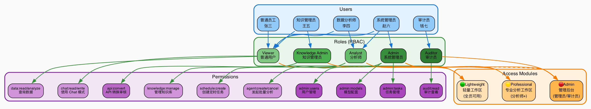
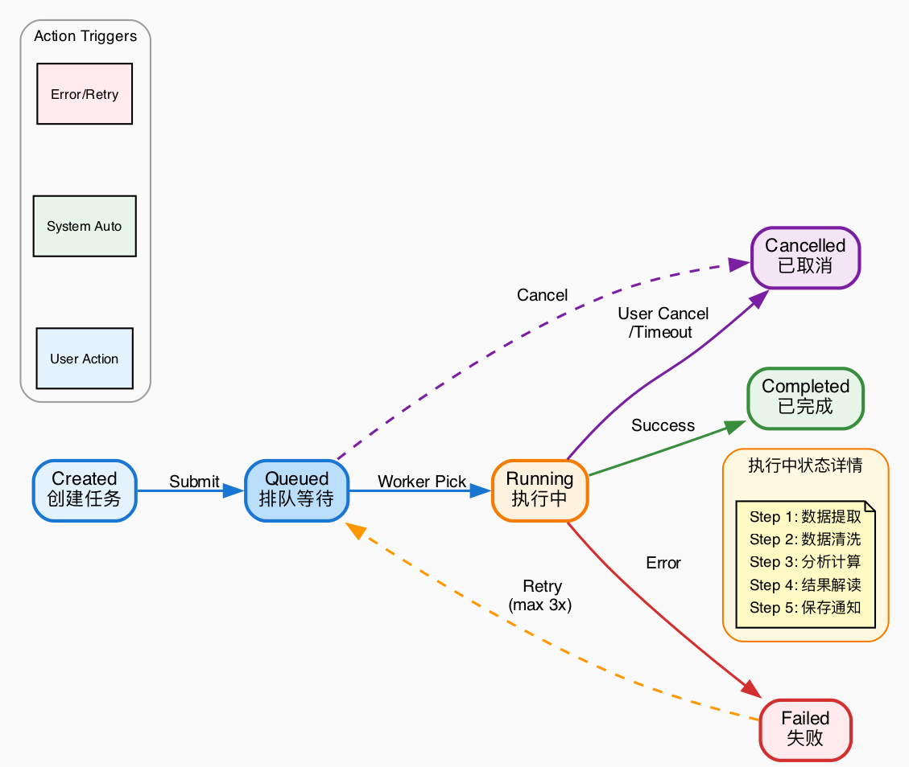
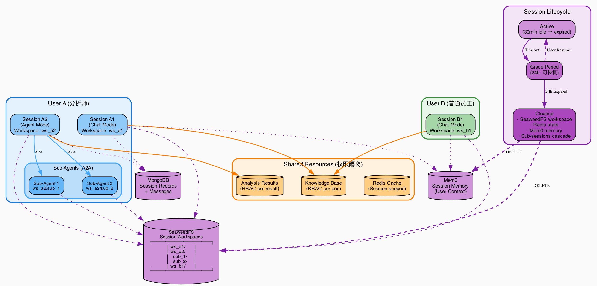
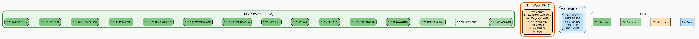

# 企业级数据分析 Agent 系统 — 产品需求文档 (PRD)

> **版本**: v1.0 | **日期**: 2026-07-01 | **状态**: MVP 设计阶段
>
> **注意**: 本文档仅描述产品需求与用户场景，不包含任何技术实现细节。

---

## 目录

1. [产品概述](#1-产品概述)
2. [用户角色与权限](#2-用户角色与权限)
3. [功能模块总览](#3-功能模块总览)
4. [功能需求详述](#4-功能需求详述)
5. [非功能需求](#5-非功能需求)
6. [MVP 范围评估](#6-mvp-范围评估)
7. [成功指标](#7-成功指标)
8. [附录: 术语表](#8-附录-术语表)
9. [MVP 里程碑与验收标准](#9-mvp-里程碑与验收标准)
10. [产品版本路线图](#10-产品版本路线图)

---

## 1. 产品概述

### 1.1 产品愿景

构建一个企业级智能数据分析平台，让不同角色的员工都能通过自然语言与数据对话——日常办公人员可以快速查询和简单分析，专业分析师可以发起复杂的批量数据处理任务。系统不仅完成数据计算，还能结合企业知识库和行业数据对结果进行深度解读，让数据真正驱动决策。

### 1.2 目标用户

| 用户类型 | 描述 | 核心需求 |
|---------|------|---------|
| 普通员工 | 日常需要查看业务数据的一线人员 | 快速查询、即时分析、获取解读 |
| 数据分析师 | 需要进行复杂统计建模的专业人员 | 批量分析、深度挖掘、定时任务 |
| 管理员 | 负责系统配置和用户管理的人员 | 权限管理、模型配置、系统监控 |
| 审计员 | 负责合规审查的人员 | 操作审计、日志查看、安全监控 |

### 1.3 产品定位

系统分为两个功能面：

- **轻量工作区**（员工日常办公入口）：面向全员，支持聊天式即时查询、快捷分析提示、轻量 Agent 任务。嵌入在聊天框中，开箱即用。
- **专业分析工作区**（授权用户入口）：面向数据分析师等有权限的员工，支持批量长时间任务、定时调度、大规模数据处理和分析。

两个工作区共享底层数据、知识库和权限体系，但界面和可用能力按角色区分。

---

## 2. 用户角色与权限

### 2.1 角色定义

| 角色 | 轻量工作区 | 专业分析工作区 | 管理后台 | 权限范围 |
|------|:---:|:---:|:---:|------|
| **普通用户** (Viewer) | ✅ | ❌ | ❌ | 查看数据、使用 Chat 查询、查看已授权知识库 |
| **分析师** (Analyst) | ✅ | ✅ | ❌ | 上述 + 发起批量分析任务、创建定时任务、使用全部 MCP 工具 |
| **知识管理员** (Knowledge Admin) | ✅ | ❌ | ✅（知识库部分） | 上述 + 管理知识库文档、审核 API→MCP 转换 |
| **系统管理员** (Admin) | ✅ | ✅ | ✅（全部） | 全部权限：用户管理、模型配置、审计日志、任务管理 |
| **审计员** (Auditor) | ❌ | ❌ | ✅（审计部分） | 只读：查看所有审计日志、操作记录 |

### 2.2 权限模型

采用**基于角色的访问控制 (RBAC)**：

- 每个用户可分配一个或多个角色
- 角色决定可访问的功能模块和可执行的操作
- 知识库文档支持按角色/用户设置可见性
- MCP 工具（Skill）支持按角色限制调用权限
- API→MCP 转换操作需要知识管理员或系统管理员审核确认



### 2.3 登录认证

- 支持企业统一账号密码登录
- 支持企业 SSO 单点登录集成（如 LDAP、OAuth）
- 登录后签发会话凭证，有过期时间
- 支持主动登出和强制下线（管理员操作）

---

## 3. 功能模块总览

```
┌─────────────────────────────────────────────────────────────┐
│                     企业数据分析 Agent 系统                    │
├───────────────┬───────────────────────┬───────────────────────┤
│   轻量工作区   │     专业分析工作区      │      管理后台         │
├───────────────┼───────────────────────┼───────────────────────┤
│ · Chat 对话   │ · Agent 批量分析      │ · 用户管理            │
│ · 快捷提示词  │ · 定时任务            │ · 权限管理            │
│ · 增强提示词  │ · 任务取消            │ · 模型配置            │
│ · 结果解读    │ · 子 Agent 协作       │ · 上下文限制           │
│ · 消息美化    │ · 异步任务通知        │ · 任务管理            │
│ · 知识库搜索  │                       │ · 知识库管理           │
│ · IM 机器人   │                       │ · 可视化数据看板        │
│   (飞书优先)   │                       │ · 审计日志            │
└───────────────┴───────────────────────┴───────────────────────┘
│                        共享基础设施                            │
│  · 数据接入层 (MCP)  · 共享知识库  · 用户认证  · RBAC 权限     │
│  · 操作审计 & 安全审查  · 邮件通知  · Session 管理             │
│  · IM 消息网关 (飞书/钉钉/企微)                                │
└─────────────────────────────────────────────────────────────┘
```

---

## 4. 功能需求详述

### F-01: 企业数据接入 (MCP)

**描述**: 将企业现有数据源通过标准化协议对接至分析平台。

**用户场景**:
- 管理员配置企业的数据库、数据仓库、API 等数据源连接
- 数据接入后，用户可在分析和查询中直接引用这些数据

**验收标准**:
- 支持接入企业主流数据源（关系型数据库、数据仓库、API 接口等）
- 数据源连接状态可视化（正常/异常/未连接）
- 数据源支持权限隔离，不同角色看到不同的数据范围

**MVP 范围**: ✅ 全部纳入 MVP — 数据接入是系统的核心基础

---

### F-02: 历史数据分析

#### F-02-1: SQL 统计分析

**描述**: 用户通过自然语言描述分析需求，系统自动生成并执行 SQL 统计，将分析结果持久化保存。

**用户场景**:
- 分析师说「统计过去6个月各产品线的销售额和同比增长率」
- 系统生成 SQL → 执行 → 结果落库 → 返回可视化摘要

**验收标准**:
- 支持从自然语言自动生成 SQL 查询
- SQL 自动执行前进行安全校验：系统自动识别并拒绝写入/修改操作（INSERT/UPDATE/DELETE/DROP 等），仅允许只读查询
- 支持查看生成的 SQL（透明可审计）
- 分析结果自动保存，支持历史回溯
- 结果以表格和图表形式呈现

#### F-02-2: 高级统计分析

**描述**: 系统提供回归分析、聚类分析、主成分分析等高级统计方法。

**推荐分析方法（产品层面）**:

| 分析类型 | 适用场景 | 典型问题示例 |
|---------|---------|------------|
| **回归分析** | 探索变量间的因果关系，预测趋势 | 「广告投入与销售额的关系是什么？」「下季度营收预测」 |
| **聚类分析** | 用户分群、产品分类、异常检测 | 「我们的客户可以分为哪几类？」「哪些产品是同一类购买模式？」 |
| **主成分分析 (PCA)** | 降维、发现关键影响因素 | 「影响客户满意度的最主要因素是什么？」「多个指标中哪些最关键？」 |
| **时间序列分析** | 周期性规律、趋势预测 | 「销售额的季节性规律是什么？」「未来6个月的趋势预测」 |

**验收标准**:
- 系统根据用户问题自动推荐合适的分析方法
- 分析过程和中间步骤可解释（非黑盒）
- 分析结果自动落库保存
- 支持对结果进行追问和二次分析

#### F-02-3: 财务数据分析

**描述**: 针对财务场景的专项分析能力。

**推荐分析方法（产品层面）**:

| 分析场景 | 说明 | 产出 |
|---------|------|------|
| **财务比率分析** | 利润率、周转率、负债率等关键指标 | 财务健康度评分卡 |
| **同比/环比分析** | 收入/成本/利润的趋势变化 | 趋势图 + 异常标注 |
| **预算偏差分析** | 实际 vs 预算对比 | 偏差热力图 |
| **现金流分析** | 经营性/投资性/筹资性现金流结构 | 现金流结构图 |
| **成本结构分析** | 按部门/产品维度的成本拆解 | 成本构成桑基图 |

**验收标准**:
- 支持导入标准财务报表格式
- 自动识别财务指标并生成分析
- 支持多期对比和趋势分析
- 异常数据自动标注和提醒

#### F-02-4: 多维度聚合分析

**描述**: 对原始数据按不同维度进行聚合，生成聚合层数据，并支持在聚合层上进一步聚合分析。

**用户场景**:
- 「按地区、产品线、季度三个维度聚合销售数据」
- 「在上一步的聚合结果上，再按客户分级做二次聚合」

**验收标准**:
- 支持用户自主选择聚合维度和指标
- 聚合结果可保存为新的数据视图
- 支持多级聚合（聚合层上再聚合）
- 聚合数据可供后续分析和查询直接引用

**MVP 范围**: 
- SQL 统计分析: ✅ MVP
- 回归分析、时间序列: ✅ MVP（核心算法）
- 聚类分析、PCA: ⚠️ MVP 后期或 V1.1（可用性依赖数据质量和引导）
- 财务数据分析: ⚠️ MVP 后期（需财务领域知识模板沉淀）
- 多维度聚合: ✅ MVP（核心能力）

---

### F-03: 分析结果智能解读

**描述**: 系统不仅给出分析结果，还结合企业知识库和行业数据提供综合解读。

**用户场景**:
- 系统输出「Q2 销售额下降 15%」
- 自动补充解读：「经查询，Q2 为公司传统淡季（历史4年同期平均下降12%），同时本季度主要竞争对手X发布了新品（来源：行业简报2026-05），综合判断本次下降部分属于季节性因素，但竞争加剧可能加速了3个百分点的下滑。」

**解读来源优先级**:
1. 企业内部知识库（经营策略、会议纪要、历史报告）
2. 行业数据库（市场报告、竞品动态）
3. 通用商业知识（季节性规律、行业常识）

**验收标准**:
- 每次分析结果自动附带解读
- 解读标注信息来源
- 支持用户对解读进行追问
- 解读质量可评价（有用/无用），用于持续优化

**MVP 范围**: ⚠️ MVP 基础版 — 先实现知识库检索 + 分析结果的简单关联解读，深度推理在后续版本完善。

---

### F-03-1: 报告格式校验与自动修正

**描述**: Agent 生成分析报告后，调用保存功能时系统自动校验格式规范，确保报告包含必要的结构和要素。若检查不通过，反馈具体缺失项给 Agent 修正后重新保存，到达重试上限后标注警告并完成保存。

**用户场景**:
- 分析师发起「生成 Q2 财务分析报告」→ Agent 生成报告并调用保存 → 系统自动检查财务报告必须包含「摘要、数据来源、分析方法、关键指标、结论」五个部分 → 缺少「数据来源」→ 反馈 Agent「请补充数据来源章节」→ Agent 修正后重新保存 → 二次检查通过 → 保存成功
- 若 Agent 连续 3 次保存仍未通过校验 → 系统在报告开头标注「⚠️ 格式校验未完全通过：缺少以下章节：数据来源」，允许保存当前版本供人工审核

**支持的规则类型**:

| 规则类型 | 说明 | 示例 |
|---------|------|------|
| **必需要素** | 报告必须包含的章节/段落 | 摘要、结论、数据来源 |
| **禁止要素** | 报告中不应出现的内容 | 未经脱敏的个人信息、系统内部调试信息 |
| **格式约束** | 报告结构的格式要求 | 至少包含一个图表、字数不少于100字 |
| **数据完整性** | 报告必须引用的数据 | 时间范围、对比基准、核心指标数值 |

**预置报告类型模板**:

| 报告类型 | 必需要素 |
|---------|---------|
| **财务分析报告** | 摘要、数据来源与范围、分析方法、关键财务指标、同比/环比数据、结论与建议 |
| **销售分析报告** | 摘要、时间范围、核心指标（销售额/订单量/客单价）、趋势分析、TOP/N分析、结论 |
| **通用数据分析报告** | 摘要、数据描述、分析过程、关键发现、结论 |
| **经营分析周报** | 本周概览、核心指标达成率、异常标注、对比上周、下周关注点 |
| **用户行为分析报告** | 摘要、数据范围、用户分层结果、关键行为指标、洞察与建议 |

**验收标准**:
- 每种报告类型有明确的必需要素清单（管理员可配置）
- Agent 调用保存报告时自动触发格式校验
- 不通过时反馈具体缺失项给 Agent，由 Agent 修正后重新保存
- 修正次数可配置（默认 3 次），到达上限后标注警告并允许保存
- 每次校验和修正过程记录审计日志
- 校验规则支持正则表达式和语义理解两种匹配方式

**MVP 范围**: ✅ 纳入 MVP — 支持预置的 5 种报告类型模板和基于正则表达式的规则检查；语义理解匹配和自定义规则配置在 V1.1 完善。

---

### F-04: Chat 模式（即时交互）

**描述**: 聊天式界面，用于快速的数据查询和简单分析，提供快捷提示词降低使用门槛，支持会话历史浏览和回溯继续。前端需对 AI 回复中的工具调用、数据分析结果、代码块、表格等特殊格式进行美化渲染。

**用户场景**:
- 输入「昨天华东区销售额多少？」→ 即时返回结果
- 点击快捷提示词「本月销售TOP10产品」→ 一键分析
- 浏览历史会话列表 → 点击「上周Q2销售分析」→ 恢复对话上下文继续追问
- AI 回复包含 SQL 查询 → 前端以代码卡片（语法高亮 + 复制按钮）形式渲染
- AI 回复包含数据表 → 前端以格式化表格渲染（斑马纹 + 排序表头 + 导出按钮）
- AI 回复包含工具调用链 → 前端以折叠卡片展示"工具调用步骤"（显示工具名 + 耗时 + 输入输出摘要）

**消息美化渲染（Message Beautification）**:
- **工具调用卡片**: 折叠式卡片，标题显示工具图标 + 名称 + 执行耗时，展开后显示输入参数和输出结果
- **SQL 代码块**: 语法高亮渲染，带「复制」和「查看执行计划」按钮
- **数据表格**: 自适应宽度的格式化表格，斑马纹行背景，支持轻量级排序
- **数据图表**: 内嵌渲染（非独立图片链接），支持工具栏（放大/下载/引用）
- **自然语言文本**: 支持 Markdown 基础语法（加粗/斜体/列表/链接）
- **状态提示**: 工具执行中显示进度动画（查询中… / 计算中… / 索引中…）

**会话历史（Session History）**:
- 左侧面板展示用户的所有历史会话（按时间倒序）
- 每条会话显示标题、最后消息摘要、时间戳、消息数量
- 点击历史会话可恢复对话上下文，继续追问
- 支持删除/归档历史会话
- 支持按关键词搜索历史会话

**快捷提示词设计**:
- 系统预置常用查询模板（如「今日数据概览」「本月趋势」「同比对比」）
- 输入框左侧提供「📋 提示词」按钮，点击弹出磨砂玻璃弹窗（低透明度，不会被背景文字干扰）
- 弹窗内展示系统预设提示词 + 用户自定义提示词，点击填入输入框
- 支持用户自定义快捷提示词并保存
- 按使用频率智能排序
- 支持按角色展示不同的快捷提示词集合

**验收标准**:
- 对话式交互，支持多轮追问
- 响应时间 < 3 秒（简单查询）
- 快捷提示词可点击一键触发
- 对话历史可保存和回溯
- 会话历史列表按时间倒序展示（最近 50 条）
- 点击历史会话恢复完整对话上下文
- 工具调用消息以折叠卡片形式渲染（含工具名、耗时、输入输出摘要）
- SQL 代码块支持语法高亮和复制按钮
- 数据表格支持斑马纹样式和轻量排序
- 图表消息内嵌渲染，支持放大/下载/引用

**MVP 范围**: ✅ 全部纳入 MVP — 核心交互入口

---

### F-05: Agent 模式（批量任务）

**描述**: 用于发起复杂的批量和长时间数据分析任务。Chat 模式和 Agent 模式共享同一个分析引擎（Agent Service），区别在于交互方式：Chat 为同步即时对话，Agent 支持同步/异步两种执行模式。

**用户场景**:
- 分析师发起「对过去3年全部销售数据做完整的回归分析和预测」
- 选择异步模式 → Agent Service 接收任务并入队 → 立即返回 task_id → Worker 从队列消费后回调 Agent Service 执行 → 完成后邮件/站内通知
- 选择同步模式 → Agent Service 直接执行 → 实时等待结果返回

**任务生命周期**:
```
创建 → 排队 → 执行中 → 完成/失败/已取消
              ↓
         可手动取消
```



**验收标准**:
- 支持实时和异步两种执行模式
- 异步任务完成后主动通知用户
- 支持查看任务执行进度和中间结果
- 支持取消正在执行的任务（包括批量分析任务）
- 任务结果永久保存，支持回溯

**MVP 范围**: ✅ 全部纳入 MVP

---

### F-06: 定时任务模式

**描述**: 设定周期性自动执行的数据分析任务，到时间自动触发 Agent 模式运行。

**用户场景**:
- 「每天早上8点自动生成前一天的销售日报」
- 「每周一上午生成上周经营分析周报」

**调度能力**:
- 支持每日、每周、每月、自定义 Cron 表达式
- 支持设置任务有效期（开始日期 ~ 结束日期）
- 任务执行失败自动重试（可配置次数）
- 任务执行结果自动保存，失败时通知负责人

**验收标准**:
- 支持灵活的调度规则配置
- 调度历史可追溯
- 失败任务告警通知
- 可随时暂停/恢复/删除定时任务

**MVP 范围**: ⚠️ MVP 基础版 — 支持每日/每周/每月调度；Cron 表达式和企业级调度策略在 V1.1

---

### F-07: Session 管理与工作区隔离

**描述**: 支持多用户同时使用，每个用户的会话相互隔离，拥有独立的工作区（临时文件、中间结果等），会话结束后自动清理。

**用户场景**:
- 用户 A 和用户 B 同时使用系统，互不干扰
- 每个会话有自己的临时数据空间
- 用户关闭会话或超时后，临时空间自动清理

**验收标准**:
- 多用户并发使用无相互影响
- 会话级工作区（临时文件存储）自动创建和销毁
- 会话超时自动清理（可配置超时时间，默认 30 分钟无操作）
- 会话清理前给用户保留期（如 24 小时内可恢复）
- 重要分析结果自动持久化（不受会话清理影响）

**MVP 范围**: ✅ 全部纳入 MVP



---

### F-08: 共享知识库

**描述**: 企业内部文档的结构化存储和智能检索系统。支持全文检索和语义搜索。文档索引由 LLM 模型自行判断拆分内容并写入向量数据库，无需额外的向量化专用模型。

**用户场景**:
- 上传公司的经营分析报告 PDF → 自动解析文本 → LLM 判断并拆分内容语义段落 → 索引到向量数据库 → 后续分析和解读中自动引用
- 搜索「去年的市场策略」→ 返回相关文档并高亮关键段落

**知识库功能**:
- 文档上传（支持 PDF、Word、Excel、Markdown、纯文本等格式）— **支持批量上传多个文件**
- 文档自动解析为纯文本
- 文档自动解析为纯文本
- **LLM 智能分片**: 由当前使用的 LLM 模型自行判断语义段落边界，将文档内容拆分为语义连贯的 Chunk，无需引入额外的向量化大模型（如 text-embedding-3）
- **异步 Agent 索引**: 文档分片和向量索引操作复用异步 Agent 任务框架，不阻塞上传请求
- **Skill 绑定文档 ID**: 知识库检索 Skill 与知识库文档 ID 强绑定，每个文档的索引数据独立隔离，避免不同文档间串数据
- 全文搜索：精确匹配关键词
- 语义搜索：理解问题含义进行模糊匹配
- 文档支持标签、分类、权限控制

**向量索引流水线**:
```
文档上传 → 文本解析 → 创建 Agent 索引任务（异步）
                                │
                    LLM 读取全文 → 判断语义段落边界
                                │
                    拆分为多个 Chunk → 生成 Embedding（复用 LLM）
                                │
                    写入向量数据库（绑定 doc_id）
                                │
                    索引完成 → 更新文档索引状态
```

**验收标准**:
- 文档上传后自动触发异步索引任务
- LLM 分片粒度合理（每个 Chunk 不超过 2000 tokens，保持语义完整）
- 向量数据与知识库文档 ID 强绑定，查询结果按 doc_id 隔离
- 不依赖额外的向量化专用模型（text-embedding 等），仅使用当前配置的 LLM
- 索引任务状态可在知识库管理界面查看（索引中 / 已完成 / 失败）
- 支持按文档名、内容、标签检索
- 搜索结果按相关度排序
- 支持按角色/用户控制文档可见性
- 支持文档版本管理

**MVP 范围**: ✅ 核心功能纳入 MVP — LLM 智能分片、异步 Agent 索引、Skill 绑定 doc_id 隔离；文档版本管理 → V1.1

---

### F-09: 邮件发送

**描述**: 系统可通过邮件发送分析结果、任务通知、告警等。

**约束条件**:
- 仅支持发往企业内部邮箱（域名白名单）
- 支持管理员添加客户邮箱到白名单
- 每次发送记录审计日志（发送人、接收人、主题、时间）

**验收标准**:
- 支持发送分析报告附件
- 收件人域名自动校验（白名单机制）
- 发送失败自动重试并通知
- 发送记录可审计

**MVP 范围**: ✅ 全部纳入 MVP

---

### F-10: API 转换工具接入

**描述**: 支持将企业内可信的 API 通过标准接口定义自动转换为系统可调用的工具，供 Agent 在分析中使用。

**用户场景**:
- 企业有一个内部 CRM API → 管理员批量上传多个 OpenAPI 定义文件 → 系统自动生成工具 → 审核确认后 Agent 可调用
- 分析「高价值客户的工单处理时效」时，Agent 自动调用 CRM API 获取数据

**安全约束**:
- 只有知识管理员和系统管理员可以发起 API 转换
- 转换后需要**另一位管理员**审核确认才能生效
- 审核内容包括：API 域名是否可信、是否有敏感数据传输、调用频率限制
- 所有 API 调用记录审计日志

**验收标准**:
- 支持标准 OpenAPI 3.0 规范文件导入
- 自动解析 API 定义并生成工具描述
- 双重审核机制（发起人 ≠ 审核人）
- API 调用全量审计
- 支持设置单 API 的调用频率限制

**MVP 范围**: ⚠️ MVP 基础版 — 支持 OpenAPI 3.0 JSON/YAML 导入和转换，双重审核在 MVP 后期

---

### F-11: 用户认证与权限管理

**描述**: 统一身份认证和三级 RBAC 权限控制。

**用户角色**:
- **system_admin（系统管理员）**：唯一，拥有全部权限。可管理所有用户、所有知识库文档，修改模型配置和系统配置
- **admin（普通管理员）**：可管理所有普通用户、属于自己的知识库文档。不可修改模型配置和系统配置
- **user（普通用户）**：只能管理自己的知识库文档，不可管理其他用户

**验收标准**:
- 支持用户名密码登录
- 系统启动时自动创建 system_admin 账号 + 随机密码（日志输出）
- system_admin 登录后头部通知提示修改初始密码
- 所有角色可在后台修改自己的密码
- RBAC 角色-权限映射清晰可配置
- admin 可创建 user 账号，不可创建 system_admin
- user 不可访问用户管理页

**MVP 范围**: ✅ 核心认证 + 三级 RBAC 纳入 MVP；SSO → V1.1

---

### F-12: 操作审计

**描述**: 完整记录所有用户操作和系统行为，支持追溯和合规审查。

**审计内容**:

| 审计类型 | 记录内容 |
|---------|---------|
| **用户操作审计** | 操作人、操作时间、操作类型、IP 地址、操作详情、操作结果 |
| **Agent 操作审计** | 触发用户、Agent ID、调用工具、参数摘要、IP 地址、执行耗时、执行结果 |
| **安全审计** | 输入/输出审查记录、违规拦截记录、敏感操作标记 |

**验收标准**:
- 所有用户操作和 Agent 操作不可篡改地记录
- 审计日志支持按时间、用户、操作类型筛选
- 审计日志支持导出
- 过期日志自动删除（可配置保留天数，默认 90 天）

**MVP 范围**: ✅ 全部纳入 MVP

---

### F-13: 安全审查层

**描述**: 对用户输入和模型输出进行基于规则的安全审查，发现异常后立即阻断并记录。

**审查规则举例**:
- 用户输入包含越权请求 → 拦截
- 模型输出包含敏感数据（如他人薪资、手机号）→ 脱敏或拦截
- Agent 尝试调用未授权的工具 → 拦截
- 输入/输出包含恶意代码或注入攻击 → 拦截

**验收标准**:
- 用户输入在进入处理前经过安全审查
- 模型输出在返回用户前经过安全审查
- 工具调用意图经过权限验证
- 拦截行为实时记录审计日志
- 安全策略可配置（管理员后台调整规则灵敏度）

**MVP 范围**: ✅ MVP 基础版 — 基于正则和关键词的规则审查；AI 审查引擎 → V1.1

---

### F-14: 子 Agent 协作

**描述**: Agent 可在当前会话下创建子 Agent 来并行处理子任务。

**用户场景**:
- 分析师发起「同时分析华北、华东、华南三个区域销售数据」→ 主 Agent 创建 3 个子 Agent 并行处理 → 汇总结果
- 主会话结束后，所有子 Agent 的会话空间一并清理

**验收标准**:
- 主 Agent 可创建多个子 Agent
- 子 Agent 执行结果可汇总至主 Agent
- 主会话清理时级联清理子会话
- 子 Agent 任务可独立取消

**MVP 范围**: ⚠️ MVP 后期 — 基础子 Agent 创建和汇总；A2A 协议完整实现 → V1.1

---

### F-15: 管理后台

**描述**: Web 管理后台，提供系统配置、监控、管理的统一入口。

**管理后台功能清单**:

| 功能模块 | 说明 |
|---------|------|
| **可视化看板** | Agent 追踪统计（调用量、成功率、耗时分布）、Token 消耗统计、产出统计（报告数/图表数/下载数）、AI Agent ROI（成本 vs 等效人力节省）、业务分析统计 |
| **用户管理** | 用户增删改查、角色分配、账号启停 |
| **权限管理** | 角色定义、权限配置、角色-权限映射 |
| **模型配置** | AI 模型切换、API 连接配置（Base URL / API Key / Model Name）、参数调整（Temperature / Top-P / 上下文长度 / 最大输出长度）。**API Key 保存至 Vault 加密存储**，前端提供眼睛按钮切换隐藏/查看原文 |
| **任务管理** | 查看/取消/重试正在运行和历史的 Agent 任务 |
| **知识库管理** | 文档上传/删除、标签管理、索引状态查看、权限设置 |
| **审计日志** | 审计日志查看、筛选、导出 |

**验收标准**:
- 所有管理功能可通过 Web 界面操作
- 可视化看板实时更新（延迟 < 10 秒）
- Token 消耗按模型/日期维度统计和展示
- 产出统计支持按类型（报告/图表/数据导出）分类
- ROI 看板以可视化的成本 vs 等效人力节省对比呈现
- 知识库文档上传后异步索引（状态可追踪）
- 任务管理支持批量取消

**MVP 范围**: 
- 用户/权限/审计管理: ✅ MVP
- 可视化看板: ✅ MVP（基础指标）
- 模型配置: ✅ MVP
- 任务管理: ✅ MVP
- 知识库管理: ✅ MVP
- 高级可视化看板: V1.1

---

### F-16: 移动端预备

**描述**: 为后续移动端（小程序、APP）接入预留接口和设计兼容性。

**MVP 策略**:
- MVP 仅支持 Web 端（桌面浏览器 + 移动浏览器响应式）
- API 设计遵循 RESTful 规范，为移动端接入做好准备
- 前端组件采用响应式设计

**验收标准 (MVP)**:
- Web 端在移动浏览器上可正常使用
- API 设计与 Web 前端的通信协议适合移动端复用

**MVP 范围**: ✅ Web 响应式纳入 MVP；独立小程序/APP → V2.0

---

### F-17: Artifact 管理

**描述**: Agent 在执行分析任务过程中生成的各类产出物（图表、导出数据、中间结果、报告附件等）统一作为 Artifact 管理和存储。用户可浏览、下载、引用任务关联的全部 Artifact。

**用户场景**:
- 分析师发起批量销售分析 → Agent 生成了 3 张趋势图、1 个 CSV 导出文件、1 份 PDF 报告 → 分析完成后，用户可在任务详情页看到所有 Artifact 列表，按类型筛选，点击预览或下载
- 用户在 Chat 对话中看到 Agent 生成的图表 → 可点击放大查看 → 可下载 PNG 原图 → 可复制引用链接分享给同事
- 管理员查看存储空间使用情况 → 按时间范围清理过期 Artifact

**Artifact 类型**:

| 类型 | 说明 | 生成场景 |
|------|------|---------|
| **图表** (chart) | 趋势图、柱状图、散点图、热力图等 PNG/SVG | 统计分析、数据可视化 |
| **导出数据** (export) | CSV、Excel 等结构化数据文件 | 数据提取、结果导出 |
| **报告附件** (report) | PDF、Word 等格式化文档 | Agent 批量分析报告 |
| **中间结果** (interim) | 临时计算数据、缓存文件 | 多步骤分析中间产物 |
| **截图** (screenshot) | 数据看板截图、异常截图 | 监控告警、数据快照 |

**Artifact 生命周期**:

```
Agent 生成 → 自动保存为 Artifact → 关联到当前任务/Session
                                          │
              ┌───────────────────────────┤
              ▼                           ▼
        用户手动保存                   Session 过期
        （标记为持久化）               （自动清理 Artifact）
              │
              ▼
        永久保存（不受 Session 清理影响）
```

**验收标准**:
- Agent 生成的图表、数据文件自动保存为 Artifact 并关联到任务
- 支持按 Artifact 类型、生成时间筛选和排序
- 支持在线预览常见格式（PNG/SVG/CSV/PDF）
- 支持单个/批量下载
- 用户可将特定 Artifact 标记为「持久化」，不受 Session 清理影响
- Artifact 支持引用（生成唯一链接，可在 Chat 中引用）
- Session 过期后，未标记持久化的 Artifact 自动清理

**MVP 范围**: ✅ 纳入 MVP — 图表和导出数据类型的自动保存、列表浏览、预览下载、持久化标记、Session 清理联动。

---

### F-18: 增强提示词 (Prompt Enhancement)

**描述**: 用户输入简短的查询意图后，系统通过大模型自动将其增强为更精确、更专业的数据分析提示词。该功能为无状态服务，不依赖于 Chat/Agent Session，不记录上下文。

**用户场景**:
- 输入「看看这个月的销售」→ 点击增强 → 系统生成「请分析本月（2026年7月）整体销售额、订单量、客单价等核心指标，对比上月数据展示环比变化，并按区域维度拆分呈现」
- 输入「分析客户」→ 点击增强 → 系统推测分析方向并生成多个可选提示词

**增强提示词设计**:
- 输入框右侧提供「✨ 增强」按钮，点击后显示加载进度圈（旋转动画）
- 调用 LLM 基于用户输入上下文（当前页面、可用数据源）将简短输入增强为精确的数据分析提示词
- LLM 返回后直接将增强结果填充到输入框（替换原始文本），用户可继续手动编辑后提交
- 增强过程无状态：不创建 Session，不记录对话历史
- 增强 LLM 调用与 Chat/Agent 使用相同的模型配置，但不计入 Chat/Agent 的 Token 统计

**验收标准**:
- 增强按钮响应时间 < 2 秒
- 增强结果直接填充输入框，不弹出选项面板
- 不创建 Session、不写入对话历史

**MVP 范围**: ✅ 纳入 MVP — 提升用户输入质量的辅助工具

---

### F-25: 站内信系统

**描述**: 系统内用户之间消息通知。

**发送类型**:
- 互发（点对点）：system_admin ↔ admin / admin ↔ user，无数量限制
- 群发：选择多个接收人，每日每发送人上限 50 条
- 全站发送：仅 system_admin，发送到通知列表页（不产生 N 条独立数据）

**验收标准**:
- 后台头部铃铛图标 + 未读数红点
- 点击展开通知列表，按时间倒序
- 未读 → 已读状态切换
- 通知 TTL 90 天自动清理
- 全站发送不产生大数据量

**MVP 范围**: ✅ 纳入 MVP### F-19: 列表管理通用规范

**描述**: 系统中所有数据列表（用户管理、任务管理、Agent 任务、审计日志、知识库文档、API 转换审核、Artifact 列表）共享统一的分页、排序、筛选交互规范。

**通用列表行为**:

| 能力 | 说明 |
|------|------|
| **分页** | 默认每页 20 条，支持切换 10/20/50/100 条/页。底部显示页码导航（上一页/下一页 + 页码跳转）|
| **排序** | 表头可点击排序（升序 ↑ / 降序 ↓ / 默认），支持按时间、状态、类型等字段排序 |
| **筛选** | 列表顶部提供筛选栏：状态筛选（全部/启用/停用/索引中等）、日期范围筛选、关键词搜索 |
| **批量操作** | 支持全选/取消全选，提供批量删除/批量导出等操作入口 |

**验收标准**:
- 所有数据列表页面实现分页、排序、筛选功能
- 分页导航正确显示总条数和总页数
- 排序方向切换正确且不影响筛选条件
- 批量操作前弹出确认对话框

**MVP 范围**: ✅ 全部纳入 MVP

---

### F-20: 密钥 Vault 管理

**描述**: 系统内所有敏感凭证（模型 API Key、数据源密码、第三方 API Token 等）统一加密存储至 Vault 服务，前端通过眼睛按钮切换隐藏/查看原文。API Key 不落盘到业务数据库，仅存储在 Vault 中并通过引用 ID 关联。

**工作原理**:
```
保存 API Key → 加密后写入 Vault → Vault 返回 key_id
存储 key_id 到业务表（如 model_configs.api_key_vault_id）
读取时 → 前端默认掩码显示（••••••••）→ 点击眼睛按钮 → 调用 Vault 解密 → 短暂显示原文
```

**验收标准**:
- API Key 仅存储于 Vault，业务表不存明文
- 前端输入框类型为 password（默认掩码），右侧眼睛按钮切换显示/隐藏
- Vault 解密需验证用户身份和权限
- Vault 支持密钥轮转

**MVP 范围**: ✅ 纳入 MVP — 基础加密存储 + 前端眼睛切换

---

### F-21: Artifact 批量下载与任务详情导航

**描述**: 任务详情页从任务列表页内联打开（无独立路由页面），详情页支持单个 Artifact 下载和批量打包下载（ZIP）。所有详情页顶部提供「返回列表」按钮。

**任务详情导航**:
```
任务列表页（一览）→ 点击某任务「查看」→ 在同页面内展示详情面板（抽屉或内联展开）
详情面板顶部: 「← 返回任务列表」按钮
详情面板内: 进度条 + 日志 + Artifact 列表（支持单个下载 + 批量 ZIP 下载）
```

**验收标准**:
- 任务列表点击「查看」在同页展开详情，不再跳转到独立页面
- 详情顶部提供「← 返回列表」按钮
- Artifact 列表支持复选框多选 + 「打包下载 (ZIP)」按钮
- 批量下载 ZIP 包文件命名格式: `task_{task_id}_artifacts_{date}.zip`

**MVP 范围**: ✅ 纳入 MVP

---

### F-22: 批量文件上传

**描述**: 知识库文档上传和 OpenAPI/MCP 转换文件上传均支持选择多个文件批量上传。

**验收标准**:
- 文件选择框支持多选（Ctrl/Cmd + 点击）
- 拖拽上传支持拖入多个文件
- 上传进度显示每个文件的独立进度条
- 批量上传不阻塞 UI，支持取消单个文件

**MVP 范围**: ✅ 纳入 MVP

### F-23: 自由探索模式 (Hermes)

**描述**: 系统集成 Hermes Agent（https://hermes-agent.nousresearch.com），提供独立的"自由探索"对话模式。管理员在系统设置中配置 Hermes 服务器地址和 API Key 后，用户可在探索模式中直接与 Hermes 进行自由对话。探索模式的 Session 由 Hermes 端管理，Data Agent 仅保存一份 Session 上下文记录（与现有 Data Agent Session 记录完全隔离），用于日志溯源和审计。

**核心理念**:
- **接口隔离**: Hermes Service 与现有 Data Agent 后端完全独立，仅共享 MongoDB 用于 Session 记录存储
- **转发模式**: API 层仅做请求转发和输入/输出记录，不参与 Hermes 内部处理逻辑
- **Session 双轨**: Hermes Session 由 Hermes 端管理；Data Agent 侧仅保存一份轻量上下文快照

**验收标准**:
- 系统设置支持配置 Hermes URL 和 API Key（加密存储至 Vault）
- 轻量工作区顶部提供「探索模式 / 分析模式」Tab 切换
- 探索模式下输入直接发送到 Hermes `/v1/chat/completions`（或 `/v1/responses` 带 Session），由 Hermes 处理并返回
- Data Agent 侧保存每次对话的 `{session_id, user_input, hermes_output, tool_calls, timestamp}` 至 MongoDB 的 `hermes_sessions` 集合
- Hermes Session 上下文记录与 Data Agent 现有 Session 列表分区存储，互不干扰
- Docker Compose 中增加 `hermes-service` 容器，独立部署
- 支持 SSE 流式输出，用户可见实时的 Hermes 响应

**MVP 范围**: ⚠️ P2 优先级

---

### F-24: IM 集成（飞书优先）

**描述**: 系统接入企业即时通讯（IM）平台，用户无需打开 Web 管理后台，直接在飞书、钉钉、企业微信中 @机器人 即可进行数据查询和分析。**MVP 阶段优先集成飞书（接入门槛最低、Go SDK 成熟），钉钉和企业微信放在 V1.1。**

**用户场景**:
- 销售总监在飞书群里 @数据分析助手：「本月华东区销售额 TOP10 产品」→ 机器人实时返回分析结果
- 分析师在飞书私聊机器人发起异步批量分析任务 → 任务完成后飞书消息通知
- 财务人员在飞书中使用快捷指令 `/周报` 一键生成本周经营分析周报

**核心交互流程**:
```
用户在IM中@机器人 或 私聊机器人
  → IM 平台 Webhook 推送到 Data Agent 消息网关
  → 用户身份识别（IM 账号 ↔ 系统账号绑定）
  → 转发到 Agent Service Chat API（复用 Chat 模式）
  → Agent 处理完成
  → 结果通过 IM 消息 API 返回（文本 + 卡片）
```

**飞书接入要点** (MVP):
- 在飞书开放平台创建企业自建应用，开通机器人能力
- 配置事件订阅（接收消息 Webhook）
- 使用 `go-lark/lark` Go SDK 实现消息收发
- 支持消息类型：文本消息、卡片消息（分析结果以卡片形式呈现）
- 用户绑定：飞书 open_id → 系统 user_id（首次使用时引导绑定）

**多平台策略**:

| 平台 | MVP | 说明 |
|------|:---:|------|
| **飞书 (Feishu/Lark)** | ✅ | 优先集成：Go SDK 成熟（go-lark），接入步骤少，内部应用无需复杂审批 |
| **钉钉 (DingTalk)** | ❌ | V1.1：配置步骤较多（7步），需卡片模板平台，适合有钉钉基础的客户 |
| **企业微信 (WeCom)** | ❌ | V1.1：自定义集成需企业认证审批，适合已有企微生态的客户 |
| **审批流集成** | ❌ | V2.0：如「分析报告审批」「数据权限申请」等需要深度 IM 集成的场景 |

**快捷指令设计**:
- `/分析 <自然语言>` — 发起数据分析
- `/查询 <自然语言>` — 快速数据查询
- `/周报` — 生成本周经营分析周报
- `/帮助` — 查看可用指令和使用说明

**用户绑定流程**:
```
首次使用机器人
  → 机器人发送绑定引导卡片
  → 用户点击「绑定账号」→ 跳转系统 Web 绑定页
  → 输入系统账号密码 → 完成飞书 open_id ↔ user_id 绑定
  → 后续消息自动识别用户身份
```

**验收标准**:
- 在飞书中 @机器人 发送数据分析问题，系统正常响应并返回结果
- Chat 模式的全部能力在 IM 渠道可用（查询、分析、快捷提示词）
- IM 消息中的分析结果以格式化卡片呈现（表格 + 关键指标 + 图表链接）
- 用户首次使用时完成 IM 账号绑定（open_id ↔ user_id）
- IM 渠道的消息记录进入审计日志（source: `feishu_bot`）
- 支持快捷指令（/分析、/查询、/周报、/帮助）
- Agent 异步任务完成后通过飞书消息通知用户
- 未绑定用户收到引导绑定提示

**MVP 范围**: ✅ 飞书机器人基础能力纳入 MVP（消息收发、文本+卡片回复、用户绑定、快捷指令、异步任务通知）；多平台扩展和高级交互卡片 → V1.1；审批流集成 → V2.0

---

### 5.1 性能

| 指标 | 目标值 |
|------|-------|
| Chat 简单查询响应 | < 3 秒 |
| Chat 复杂分析响应 | < 10 秒 |
| Agent 任务排队确认 | < 5 秒 |
| 知识库文档搜索响应 | < 2 秒 |
| 管理后台页面加载 | < 3 秒 |
| 并发用户数 (MVP) | ≥ 50 |

### 5.2 可用性

- 系统可用性 ≥ 99.5%（工作时间）
- Agent 任务失败自动重试（最多 3 次）
- 关键操作有确认机制（如删除、取消任务）
- 错误信息对用户友好可理解

### 5.3 安全

- 用户密码加密存储
- 会话凭证有过期时间且支持主动失效
- 数据传输加密（HTTPS）
- API 调用需要鉴权
- 所有敏感操作记录审计日志
- 输入/输出内容安全审查
- 邮箱白名单机制防止数据泄露
- 敏感凭证（密钥、密码、Token）集中安全管理，支持动态轮转

### 5.4 可扩展性

- 新增数据分析方法不需要改动核心系统
- 新增 MCP 工具/Skill 通过配置即可接入
- 知识库支持水平扩展
- 分析结果和实体数据统一持久化存储，支持备份和恢复

---

## 6. MVP 范围评估

### 6.1 MVP 范围总结

| 功能 | MVP 阶段 | 说明 |
|------|:---:|------|
| F-01 数据接入 (MCP) | ✅ | 核心基础，必须完成 |
| F-02-1 SQL 统计分析 | ✅ | 最常用场景 |
| F-02-2 高级统计分析 | ✅ | 回归 + 时间序列先上，聚类/PCA后续 |
| F-02-3 财务数据分析 | ⚠️ | MVP 后期，先沉淀财务模板 |
| F-02-4 多维度聚合 | ✅ | 核心能力 |
| F-03 智能解读 | ⚠️ | MVP 基础版，深度解读后续迭代 |
| F-03-1 报告格式校验与自动修正 | ✅ | 5 种报告类型模板 + 正则规则检查 |
| F-04 Chat 模式 | ✅ | 核心交互入口 + 消息美化渲染 |
| F-05 Agent 模式 | ✅ | 核心差异化能力 |
| F-06 定时任务 | ⚠️ | MVP 基础调度，高级策略后续 |
| F-07 Session 管理 | ✅ | 基础架构 |
| F-08 共享知识库 | ✅ | LLM 分片 + 异步 Agent 索引 + Skill-doc_id 绑定 |
| F-09 邮件发送 | ✅ | 通知闭环 |
| F-10 API 转工具 | ⚠️ | MVP 基础转换，双重审核后续 |
| F-11 认证权限 | ✅ | 安全基础 |
| F-12 操作审计 | ✅ | 合规基础 |
| F-13 安全审查 | ✅ | MVP 规则审查层 |
| F-14 子 Agent | ⚠️ | MVP 后期基础实现 |
| F-15 管理后台 | ✅ | 基础管理功能 |
| F-16 移动端 | ❌ | 仅 Web 响应式，独立客户端 V2.0 |
| F-17 Artifact 管理 | ✅ | 图表/导出自动保存、预览下载、持久化标记 |
| F-18 增强提示词 | ✅ | 无状态 LLM 输入增强，不依赖 Session |
| F-19 列表管理规范 | ✅ | 分页/排序/筛选/批量操作 |
| F-20 密钥 Vault | ✅ | API Key 加密存储 + 眼睛切换 |
| F-21 Artifact 批量/ZIP下载 | ✅ | 任务详情内联 + 批量打包 |
| F-22 批量文件上传 | ✅ | KB + OpenAPI 批量上传 |
| F-23 自由探索模式 | ⚠️ | Hermes 集成，P2 优先级 |
| F-24 IM 集成（飞书优先） | ✅ | 飞书机器人基础能力：消息收发、卡片回复、用户绑定、快捷指令、异步通知；钉钉/企微 → V1.1 |
| F-25 站内信系统 | ✅ | 点对点 + 群发（限50条/天）+ 全站发送，TTL 90天 |



### 6.2 MVP "完成" 定义

MVP 完成后，系统应能够支撑以下**端到端场景**:

1. 管理员配置数据源 → 分析师用自然语言发起 SQL 统计 → 系统生成 SQL 并执行 → 结果落库 + 解读 → 分析师可追问
2. 普通员工用 Chat 模式快速查询业务数据 → 点击快捷提示词 → 即时获取分析
3. 分析师发起批量回归分析任务（异步）→ 任务完成后邮件通知 → 结果自动保存并可回溯
4. 管理员上传财务报告到知识库 → LLM 自动分片 → 异步 Agent 索引 → 索引完成后可搜索引用
5. 审计员查看所有操作记录 → 按时间/用户筛选 → 导出审计报告
6. 安全审查层拦截越权输入 → 记录日志 → 通知管理员

---

## 7. 成功指标

### 7.1 用户采用指标

| 指标 | MVP 目标 |
|------|---------|
| 日活跃用户 (DAU) | ≥ 20 |
| 日均 Chat 查询次数 | ≥ 50 |
| 日均 Agent 任务数 | ≥ 5 |
| 知识库文档数 | ≥ 30 |
| 快捷提示词使用率 | ≥ 30% |

### 7.2 质量指标

| 指标 | MVP 目标 |
|------|---------|
| SQL 生成准确率 | ≥ 80% |
| 分析解读有用率（用户评价） | ≥ 70% |
| Agent 任务成功率 | ≥ 95% |
| 搜索相关性 (NDCG@5) | ≥ 0.8 |

### 7.3 满意度指标

- 用户满意度 NPS ≥ 30
- 关键操作完成时间 ≤ 预期 1.2 倍

---

## 8. 附录: 术语表

| 术语 | 说明 |
|------|------|
| **MCP** | 标准化的工具/数据连接协议，用于系统与外部数据源和服务的对接 |
| **Agent** | 具备自主规划和执行能力的智能体，可调用多种工具完成复杂任务 |
| **Skill** | 可被 Agent 调用的标准化工具能力单元 |
| **Chat 模式** | 对话式交互，一问一答，适合即时查询 |
| **Agent 模式** | 任务式交互，发起后自主执行，适合批量长时间任务 |
| **Session** | 用户的一次使用会话，包含对话历史和临时工作空间 |
| **A2A 协议** | Agent 之间通信和协作的协议 |
| **RBAC** | 基于角色的访问控制 (Role-Based Access Control) |
| **快捷提示词** | 预设的自然语言查询模板，点击即可触发分析 |
| **知识库** | 企业文档的结构化存储和智能检索系统 |
| **聚合层** | 在原始数据基础上按维度聚合后的中间数据层 |

---

## 9. MVP 里程碑与验收标准

### 9.1 总体时间线

```
W1──── W2 ──── W3 ──── W4 ──── W5 ──── W6 ──── W7 ──── W8 ──── W9 ──── W10 ── W11 ── W12
| Phase 1    || Phase 2    || Phase 3    || Phase 4    || Phase 5    || Phase 6   |
│ 基础框架    ││ 核心服务    ││ 知识库      ││ 高级功能    ││ 管理后台    ││ 测试优化   │
├────────────┤├────────────┤├────────────┤├────────────┤├────────────┤├───────────┤
│ M1         ││ M2         ││ M3         ││ M4         ││ M5         ││ M6        │
```

### 9.2 里程碑定义

| 里程碑 | 时间 | 关键交付 | 验收标准 |
|--------|------|---------|---------|
| **M1: 基础设施就绪** | Week 2 | 开发环境 + 核心基础设施 | 所有基础服务可正常启动和调用 |
| **M2: Chat MVP** | Week 4 | 对话式数据查询可用 | 自然语言查询 → 生成 SQL → 执行 → 结果流式返回 |
| **M3: Agent MVP** | Week 6 | 批量分析任务可用 | 异步任务创建 → 执行 → 通知闭环 |
| **M4: 知识库上线 + IM 可用** | Week 8 | 知识库搜索 + 结果解读 + 飞书机器人 | 文档上传 → 搜索 → 分析结果自动解读；飞书 @机器人 可进行数据查询和分析 |
| **M5: 管理后台完整** | Week 10 | 管理后台全部功能 | 所有管理功能可操作 |
| **M6: Alpha Release** | Week 12 | 内部可用版本 | 全部端到端场景跑通，可内部试用 |

### 9.3 各阶段产品验收标准

#### M1: 基础设施就绪 (Week 2)

- [ ] 管理员可登录系统
- [ ] 用户认证（登录/登出/Token 刷新）可用
- [ ] RBAC 权限校验生效
- [ ] 操作审计日志开始记录

#### M2: Chat 模式可用 (Week 4)

- [ ] 用户通过自然语言发起 SQL 统计查询，系统生成并执行 SQL
- [ ] 查询结果流式返回，支持多轮追问
- [ ] 分析结果自动保存，支持历史回溯
- [ ] 系统预置的快捷提示词可一键触发分析
- [ ] 相同查询 5 分钟内命中缓存直接返回（性能优化）

#### M3: Agent 模式可用 (Week 6)

- [ ] 分析师可创建批量分析任务（同步/异步两种模式）
- [ ] 异步任务进入队列 → Worker 执行 → 完成后邮件+站内通知
- [ ] 支持实时查看任务执行进度
- [ ] 支持手动取消正在执行的任务
- [ ] 任务结果永久保存并支持回溯
- [ ] 回归分析、时间序列分析可用
- [ ] 多维度聚合层数据可定义和管理

#### M4: 知识库上线 + 飞书 IM 可用 (Week 8)

- [ ] 上传 PDF/Word/Excel/Markdown 文档 → 自动解析 → 异步索引
- [ ] 语义搜索 + 全文搜索 + 混合搜索均可用
- [ ] 搜索结果按用户权限自动过滤
- [ ] 分析结果附带基于知识库的解读内容
- [ ] 解读标注信息来源
- [ ] 邮件通知支持域名白名单校验
- [ ] **飞书机器人可接收消息并返回分析结果**
- [ ] **用户在飞书 @机器人 发送查询 → 系统正常响应**
- [ ] **飞书用户首次使用时完成账号绑定（open_id ↔ user_id）**
- [ ] **分析结果以飞书卡片消息呈现（表格 + 指标 + 图表链接）**
- [ ] **快捷指令（/分析 /查询 /周报 /帮助）可用**
- [ ] **Agent 异步任务完成后飞书通知用户**

#### M5: 管理后台完整 (Week 10)

- [ ] 登录管理后台，菜单按角色权限显示
- [ ] Dashboard 可视化看板展示 Agent 调用量/成功率/业务指标
- [ ] 用户增删改查、角色分配、账号启停
- [ ] 角色定义、权限配置可管理
- [ ] 模型选择、参数、上下文限制可配置
- [ ] 任务列表可查看进度、取消任务、重试失败任务
- [ ] 知识库文档上传后状态可追踪
- [ ] 审计日志可筛选、导出

#### M6: Alpha Release (Week 12)

- [ ] 以下 6 个端到端场景全部跑通:
  1. 管理员配置数据源 → 分析师自然语言发起 SQL 统计 → 生成 SQL→ 执行 → 结果落库+解读 → 可追问
  2. 普通员工 Chat 快速查询 → 快捷提示词 → 即时获取分析
  3. 分析师发起批量回归分析（异步）→ 任务完成邮件通知 → 结果可回溯
  4. 管理员上传财务报告到知识库 → 文档自动索引 → 分析中自动引用
  5. 审计员查看操作记录 → 按时间/用户筛选 → 导出审计报告
  6. 安全审查层拦截越权输入 → 记录日志 → 通知管理员
- [ ] Chat 查询 P99 < 3s（简单），< 10s（复杂）
- [ ] 并发 50 用户无异常
- [ ] 内部 5+ 用户试用一周无阻塞性问题

---

## 10. 产品版本路线图

| 版本 | 时间 | 核心目标 | 主要功能 |
|------|------|---------|---------|
| **MVP** | Week 1-12 | 核心能力可用 | 数据接入、SQL统计、回归+时间序列、多维度聚合、Chat+Agent模式、Session管理、Artifact管理、知识库(基础)、邮件、认证RBAC、审计+安全审查、管理后台(基础)、智能解读(基础)、报告格式校验、定时任务(基础)、API转换(基础)、子Agent(基础)、**飞书IM集成（消息收发+卡片+快捷指令+用户绑定）** |
| **V1.1** | Week 13-18 | 能力补全 | 财务分析、API转MCP双重审核、子Agent A2A完整、Cron高级调度、深度解读、AI审查引擎、SSO集成、聚类+PCA分析、**钉钉/企微IM集成、交互式卡片、消息模板管理** |
| **V2.0** | Week 19+ | 生态扩展 | 独立小程序/APP、高级可视化看板、知识库版本管理、多租户支持、数据血缘追踪、**IM审批流集成（分析报告审批、数据权限申请）** |
