# DataAgent 企业数据分析平台 — UI 原型设计文档

> **版本**: v1.1 | **日期**: 2026-07-02 | **风格**: 深色玻璃极光 (Glass Vision OS Aurora) + Apple 极简设计
>
> **设计文件**: https://ardot.tencent.com/file/699615122514275
>
> **交互原型**: `outputs/prototype.html` (单 HTML 文件，12 页面 + 5 种 Chart.js 图表)
>
> **截图目录**: `outputs/screenshots/` (12 张 2x 高清 PNG + PDF 合集)

---

## 1. 设计系统

### 1.1 设计哲学

融合 **Apple Vision OS 玻璃空间感** + **AWS/腾讯云控制台的信息密度** + **极光渐变的未来科技感**，打造企业老板「第一眼震撼」的数据平台。

### 1.2 色彩系统

| Token | 色值 | 用途 |
|-------|------|------|
| `bg-primary` | `#000000` | 全局背景 |
| `bg-sidebar` | `#13121C` | 侧边栏 |
| `bg-glass` | `rgba(255,255,255,0.05)` | 玻璃卡片填充 |
| `border-glass` | `rgba(255,255,255,0.10)` | 玻璃卡片边框 |
| `accent-cyan` | `#B1E2FF` | 极光蓝（主色） |
| `accent-purple` | `#9381FF` | 极光紫（辅助渐变） |
| `success-green` | `#34D399` | 成功/在线/增长 |
| `warning-amber` | `#FBBF24` | 警告/排队中 |
| `error-pink` | `#FB7185` | 错误/失败/下降 |
| `text-primary` | `#FFFFFF` | 主标题 |
| `text-secondary` | `#7A7A7A` | 辅助文本 |
| `text-muted` | `#666666` | 标签/时间戳 |

### 1.3 字体系统

| 层级 | 字体 | 字号 | 字重 | 用途 |
|------|------|:---:|------|------|
| 页面标题 | Inter | 20px | SemiBold | 页面 Header |
| 卡片标题 | Inter | 18px | SemiBold | 图表/模块标题 |
| KPI 数值 | IBM Plex Mono | 42px | SemiBold | 核心指标 |
| 正文 | Inter | 14px | Regular | 描述文本 |
| 标签 | Inter | 12px | SemiBold | 分类标签/时间戳 |
| 数据 | IBM Plex Mono | 12-16px | SemiBold | 表格数据/状态数 |

### 1.4 圆角与间距 (Apple 风格)

- **卡片圆角**: 20px (HTML) / 28px (设计稿)
- **按钮圆角**: 10-16px
- **输入框圆角**: 14px
- **标签 Pill**: 12-13px
- **卡片内边距**: 24-32px (KPI 卡片 32px，图表卡片 28px)
- **表格单元格内边距**: 16px 20px (水平留白充足)
- **卡片间距**: 20-24px
- **文本边距**: 所有文本距容器边缘 ≥ 16px，杜绝贴边

### 1.5 导航图标

侧边栏 12 个导航项使用 SVG 线性图标（Feather Icons 风格，2px 描边），激活态转为 #B1E2FF 高亮：

| 导航项 | 图标 |
|-------|------|
| 轻量工作区 | chat-bubble (对话气泡) |
| 专业工作区 | grid (网格) |
| 任务详情 | clipboard-check (剪贴板勾选) |
| 数据看板 | dashboard-grid (面板网格) |
| 用户管理 | users (多人) |
| 权限管理 | shield (盾牌) |
| 模型配置 | settings (齿轮) |
| 任务管理 | clock (时钟) |
| 知识库管理 | book (书本) |
| 审计日志 | search (搜索) |
| API 转换审核 | link/plug (链接) |

### 1.6 特效

- **玻璃卡片**: 填充 rgba(255,255,255,0.05) + 1px 白色 10% 边框 + 8px 深阴影
- **渐变按钮**: 线性渐变 #B1E2FF → #9381FF
- **渐变头像**: 线性渐变 #B1E2FF → #9381FF
- **柱状图渐变**: 蓝/紫/绿/琥珀色渐变柱条
- **呼吸灯**: 绿色脉冲点 (实时状态)

---

## 2. 页面总览 (PRD 功能映射)

| 序号 | 页面 | 对应 PRD | 对应 RFC | 说明 |
|:---:|------|:---:|:---:|------|
| 1 | 登录页 | F-11 认证权限 | §4.1, §4.2 | 邮箱/密码 + SSO |
| 2 | 轻量工作区 (Chat) | F-04 Chat 模式 + F-07 Session 管理 | §4.2 Chat 同步 | 即时查询 + 快捷提示词 + 会话历史 |
| 3 | 专业工作区 (Agent 列表) | F-05 Agent 模式 | §4.3 Agent 异步 | 批量任务管理 |
| 4 | 任务详情 | F-05 任务生命周期 | §4.3 Agent 异步 | 进度追踪 + Artifact |
| 5 | 数据看板 | F-15 可视化看板 | §13 监控 | KPI + Token/产出/ROI + 图表矩阵 |
| 6 | 用户管理 | F-15 用户管理 | §4.1 认证 | CRUD + 角色分配 |
| 7 | 权限管理 | F-15 权限管理 | §4.1 RBAC | 角色定义 + 权限映射 |
| 8 | 模型配置 | F-15 模型配置 | §5.1 LLM Router | LLM 连接配置 + 参数调整 |
| 9 | 任务管理 | F-15 任务管理 | §4.3 | 全局任务监控 |
| 10 | 知识库管理 | F-08 共享知识库 | §6 | 文档上传 + 索引状态 |
| 11 | 审计日志 | F-12 操作审计 | §4.6 审计 | 全量操作记录 |
| 12 | API 转换审核 | F-10 API 转工具 | §5.5 OpenAPI→MCP | OpenAPI 导入 + 双重审核 |

---

## 3. 页面详述

### 3.1 登录页 (Screen 1)

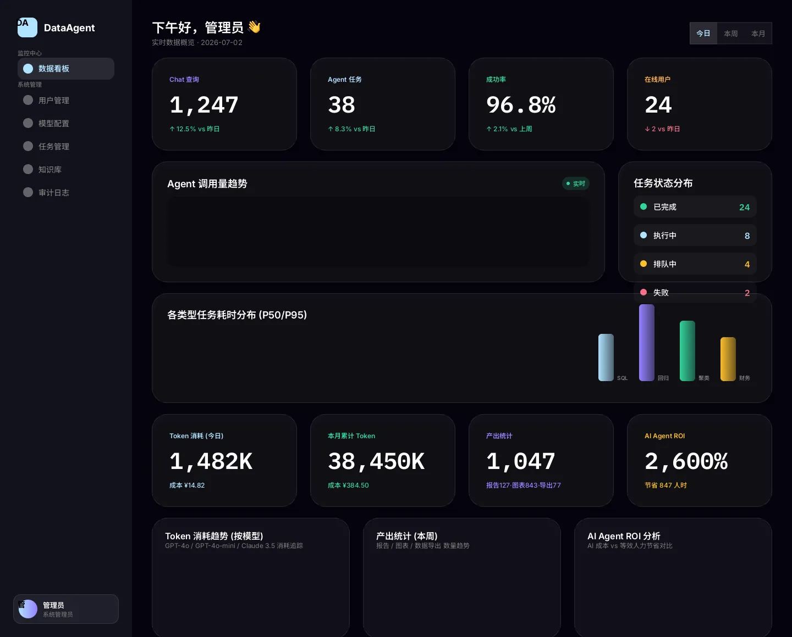

**PRD 映射**: F-11 认证权限 — 企业统一账号密码登录 + SSO 单点登录

**布局**: 纯黑背景 + 居中玻璃卡片 (420×"hug")

**元素清单**:
- Logo: DA 图标 (#B1E2FF 圆角方) + "DataAgent" 品牌名
- 标题: "登录企业数据分析平台" (20px SemiBold)
- 邮箱输入框: 标签"邮箱地址" + 输入框 (placeholder: name@company.com)
- 密码输入框: 标签"密码" + 输入框 (掩码 ········)
- 登录按钮: 蓝紫渐变填充 + 黑字 + 全宽
- 分隔线: "或" 文字 + 左右横线
- SSO 按钮: 透明背景 + 白色边框 + "企业 SSO 单点登录"

---

### 3.2 轻量工作区 — Chat 模式 (Screen 2)

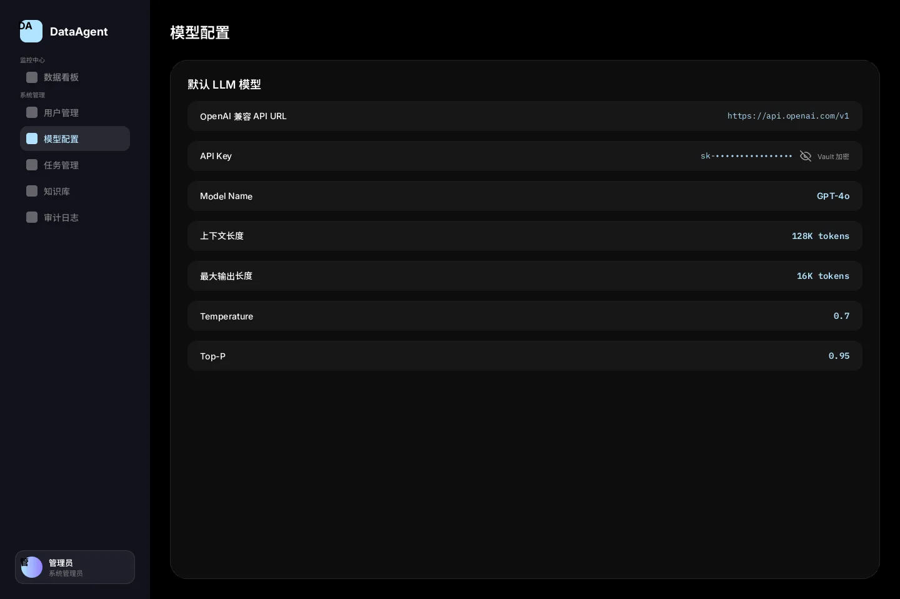

**PRD 映射**: F-04 Chat 模式 + F-18 增强提示词 — 对话式即时查询 + 快捷提示词 + 消息美化渲染 + 无状态 LLM 增强 + 会话历史管理 + 结果表格/图表呈现

**布局**: 240px 深色侧边栏 + 会话历史侧边栏 (280px) + 主内容区 (水平)

**主侧边栏**:
- Logo 区: DA 图标 + DataAgent
- 导航区: 轻量工作区(高亮) / 专业工作区 / 知识库
- 底部: 用户卡片 (渐变头像 + 张三 + 数据分析师)

**会话历史侧边栏** (新增):
- 标题: "📋 历史会话" + "新对话" 按钮
- 搜索框: 搜索历史会话
- 会话列表 (按时间倒序):
  - Q2 华东区销售分析 — 8 条消息 · 今天 10:32 (当前活跃)
  - 本月销售趋势分析 — 5 条消息 · 今天 09:15
  - 客户聚类分群 — 12 条消息 · 昨天 17:40
  - 财务比率同比分析 — 6 条消息 · 昨天 14:20
  - 库存周转率查询 — 3 条消息 · 7/1 11:00
  - Q1 营收概览 — 9 条消息 · 6/30 16:30
  - 竞品价格对比分析 — 7 条消息 · 6/30 09:00
- 交互: 点击会话 → 恢复对话上下文继续追问

**主内容区**:
- Header: "轻量工作区" + 在线状态 Badge (绿点 + "在线") + "新对话" 按钮
- 快捷提示词行: 4 个 Pill 标签 — 「今日数据概览」(蓝底高亮)、「本月销售趋势」、「同比环比分析」、「TOP10 产品」
- **增强提示词**: 输入框右侧 "✨ 增强" 按钮，点击弹出 3 个 LLM 增强版本建议，点击选择填入输入框（无状态，不创建 Session）
- 消息区:
  - 用户消息: 蓝紫渐变气泡 (右对齐)
  - AI 工具调用卡片: 折叠式卡片（工具图标 + 名称 + 耗时 + 输入输出），展开显示完整参数和结果
  - SQL 代码块: 语法高亮渲染（关键字蓝色 / 字符串粉色 / 数字黄色），带复制按钮
  - 数据表格: 斑马纹格式化表格，支持排序和导出
  - 进度提示: 旋转动画 + 状态文本（查询中…/计算中…/索引中…）
- 底部输入区: 输入框 + "✨ 增强" 按钮 + 渐变发送按钮

---

### 3.3 专业工作区 — Agent 任务列表 (Screen 3)

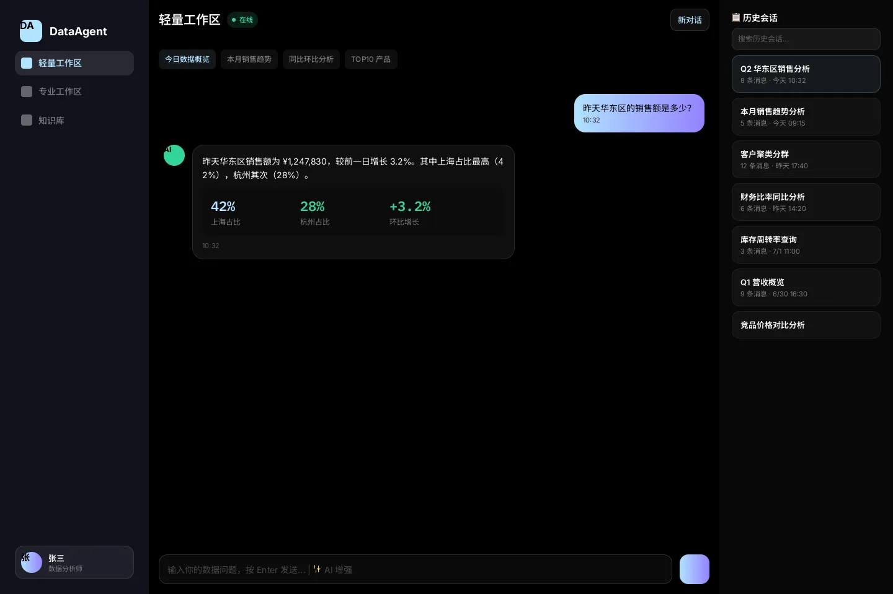

**PRD 映射**: F-05 Agent 模式 — 批量分析任务创建 + 任务状态管理 + 定时任务筛选

**布局**: 同侧边栏 + 主内容区

**主内容区**:
- Header: "专业工作区 · 任务管理" + 蓝紫渐变"新建分析任务"按钮
- 筛选标签: 全部(高亮) / 执行中 / 已完成 / 定时任务
- 任务列表 (4 行示例):

| 任务名称 | 状态 | 类型 | 创建时间 |
|---------|:---:|------|---------|
| Q2 华东区销售回归分析 | 🟢 执行中 | 回归分析 | 2026-07-02 10:30 |
| 全国客户聚类分析 | 🟡 排队中 | 聚类分析 | 2026-07-02 09:15 |
| 月度财务比率分析报告 | 🟢 已完成 | 财务分析 | 2026-07-01 14:20 |
| 多维度销售聚合分析 | 🔴 失败 | 聚合分析 | 2026-07-01 08:00 |

---

### 3.4 任务详情 (Screen 4)

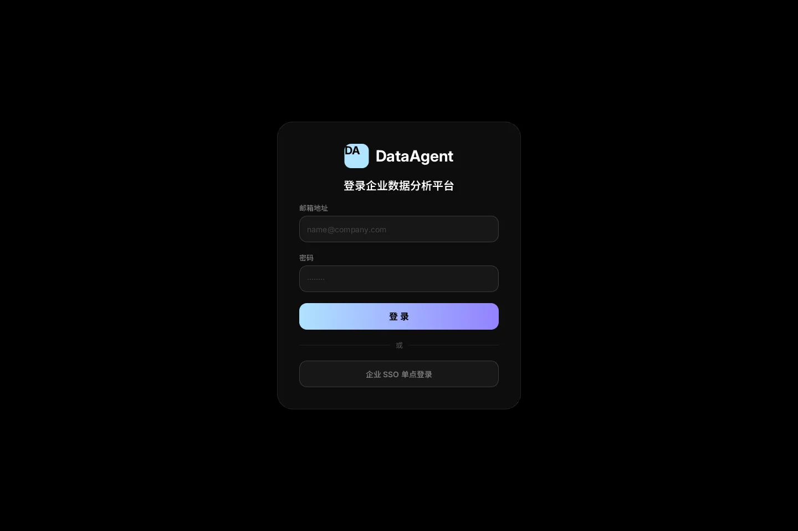

**PRD 映射**: F-05 任务生命周期 + F-17 Artifact 管理 — 进度追踪 + 产出物浏览 + 执行日志

**布局**: 侧边栏 + 主内容区 (水平双列)

**左侧面板**:
- 进度卡片:
  - 标题: "任务进度"
  - 进度条: 65% 蓝紫渐变填充
  - 百分比: "65%" (IBM Plex Mono 24px Bold, #B1E2FF)
  - 4 步步骤指示器: SQL生成✅ / 数据提取✅ / 回归计算🔵 / 生成报告⏸
- 执行日志卡片:
  - 标题: "执行日志"
  - [10:30:15] SQL 生成完成 (绿)
  - [10:30:18] 数据提取完成 (绿)
  - [10:31:22] 回归分析进行中 (蓝)

**右侧面板**:
- 产出物卡片:
  - 标题: "产出物 (Artifacts)"
  - 趋势图.png — 245 KB · Chart
  - export.csv — 1.2 MB · Export

---

### 3.5 数据看板 — Dashboard (Screen 5)

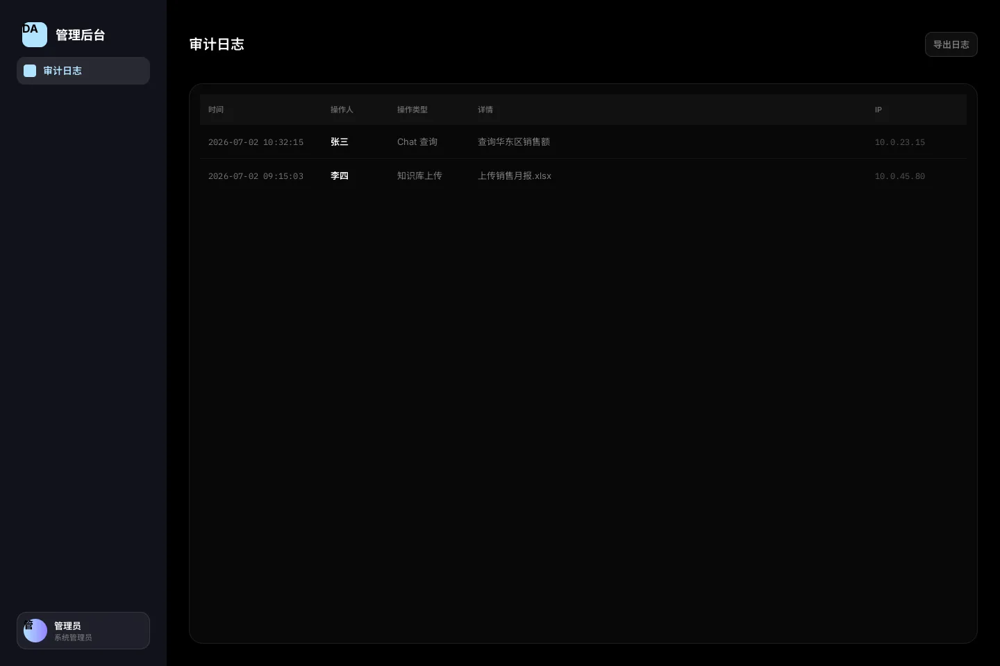

**PRD 映射**: F-15 可视化看板 — Agent 追踪统计（调用量、成功率、耗时分布）、Token 消耗统计、产出统计、AI Agent ROI、业务分析统计

**布局**: 管理后台侧边栏 (7 项导航) + 主内容区

**管理后台侧边栏** (所有后台页面共享):
- 监控中心: 数据看板(高亮)
- 系统管理: 用户管理 / 模型配置 / 任务管理 / 知识库 / 审计日志
- 底部: 管理员用户卡片 (渐变头像 + 管理员 + 系统管理员)

**主内容区**:
- 顶部栏:
  - 左侧: "下午好，管理员 👋" (24px) + "实时数据概览 · 2026-07-02" (13px)
  - 右侧: 时间筛选标签 — 今日(高亮) / 本周 / 本月
- **KPI 卡片行** (4 个横排玻璃卡片, 28px 圆角):

| 标签 | 数值 | 变化 |
|------|:---:|------|
| Chat 查询 (紫色) | **1,247** | ↑ 12.5% vs 昨日 |
| Agent 任务 (蓝色) | **38** | ↑ 8.3% vs 昨日 |
| 成功率 (绿色) | **96.8%** | ↑ 2.1% vs 上周 |
| 在线用户 (琥珀色) | **24** | ↓ 2 vs 昨日 |

- **图表行 1** (水平双列):
  - 左侧: Agent 调用量趋势图 (大图表区域 + "实时" Badge)
  - 右侧: 任务状态分布面板 (已完成 24 / 执行中 8 / 排队中 4 / 失败 2)

- **图表行 2** (三列):
  - 柱状图: 各类型任务耗时分布 (P50/P95)
    - SQL (蓝色渐变柱) · 回归 (紫色渐变柱) · 聚类 (绿色渐变柱) · 财务 (琥珀渐变柱)
  - 24h 请求量分布 (绿色渐变柱状图)
  - 成功率趋势 (7天) — 绿色面积图

- **Token / 产出 / ROI 指标卡片行** (新增 4 个 KPI 卡片):

| 标签 | 数值 | 变化 |
|------|:---:|------|
| Token 消耗 (今日) (青色) | **1,482K** | 成本 ¥14.82 |
| 本月累计 Token (绿色) | **38,450K** | 成本 ¥384.50 |
| 产出统计 (紫色) | **1,047** | 报告127·图表843·导出77 |
| AI Agent ROI (琥珀色) | **2,600%** | 节省 847 人时 |

- **图表行 3** (新增三列):
  - Token 消耗趋势 (按模型) — GPT-4o / GPT-4o-mini / Claude 3.5 堆叠柱状图
  - 产出统计 (本周) — 报告 / 图表 / 数据导出 分组柱状图
  - AI Agent ROI 分析 — AI 成本 (¥) vs 等效人时节省 双轴图表

---

### 3.6 用户管理 (Screen 6)

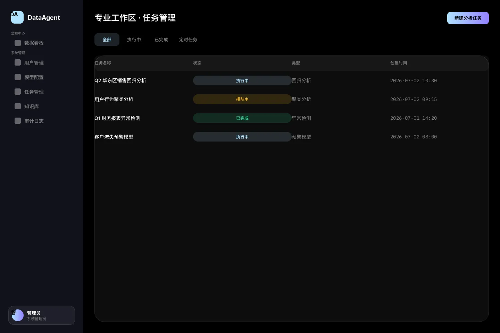

**PRD 映射**: F-15 用户管理 — 用户增删改查、角色分配、账号启停

**侧边栏**: 用户管理(高亮)

**主内容区**:
- Header: "用户管理" + 渐变"添加用户"按钮
- 用户表格 (3 行示例):

| 姓名 | 邮箱 | 角色 | 状态 |
|------|------|------|:---:|
| 张三 | zhangsan@company.com | 数据分析师 | 🟢 启用 |
| 李四 | lisi@company.com | 普通用户 | 🟢 启用 |
| 王五 | wangwu@company.com | 知识管理员 | 🔴 停用 |

---

### 3.7 权限管理 (Screen 7)

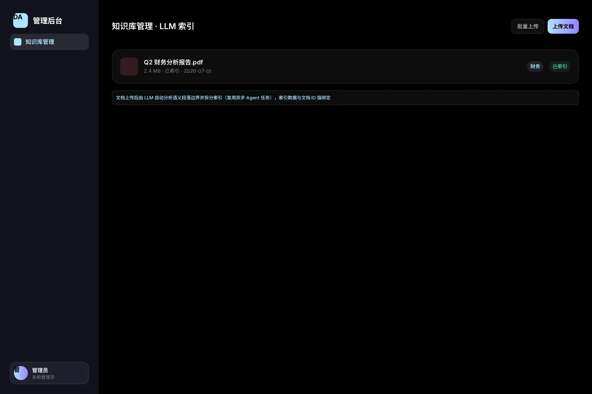

**PRD 映射**: F-15 权限管理 — 角色定义、权限配置、角色-权限映射

**侧边栏**: 权限管理(高亮)

**主内容区**:
- Header: "权限管理" + "新建角色"按钮
- 角色卡片 (2 个横排):
  - 系统管理员: 全部系统权限 (用户管理、模型配置、审计日志、任务管理)
  - 数据分析师: 发起批量分析、创建定时任务、使用全部 MCP 工具

---

### 3.8 模型配置 (Screen 8)

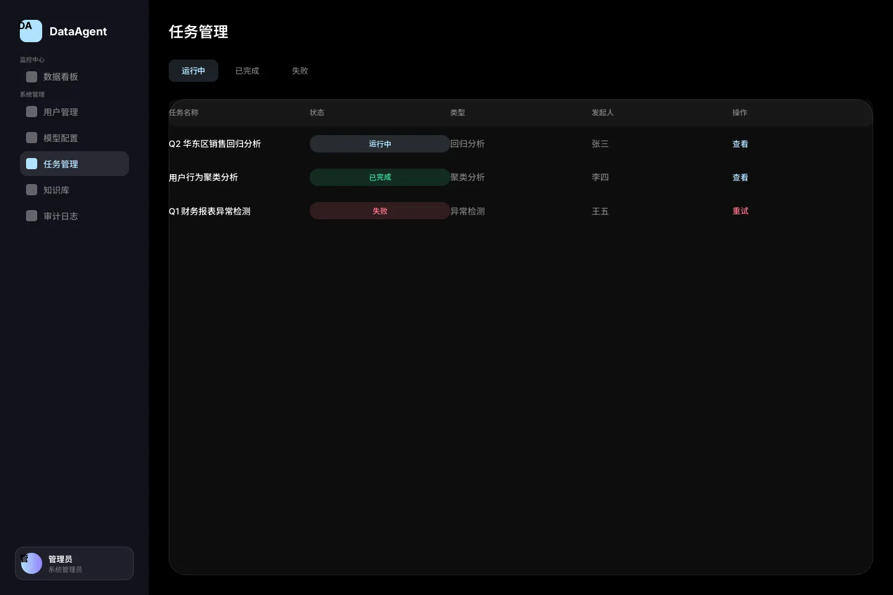

**PRD 映射**: F-15 模型配置 — AI 模型切换、API 连接配置（Base URL / API Key / Model Name）、参数调整（Temperature / Top-P / 上下文长度 / 最大输出长度）

**侧边栏**: 模型配置(高亮)

**主内容区**:
- Header: "模型配置"
- 配置卡片:
  - **OpenAI 兼容 API URL**: 文本输入框（默认 `https://api.openai.com/v1`）
  - **API Key**: 密码输入框（掩码显示）
  - **Model Name**: 下拉框（GPT-4o / GPT-4o-mini / Claude 3.5 Sonnet / Gemini 2.0 Flash）
  - **上下文长度限制**: 128K tokens
  - **最大输出长度**: 16K tokens
  - **Temperature**: 0.7
  - **Top-P**: 0.95

---

### 3.9 任务管理 (Screen 9)

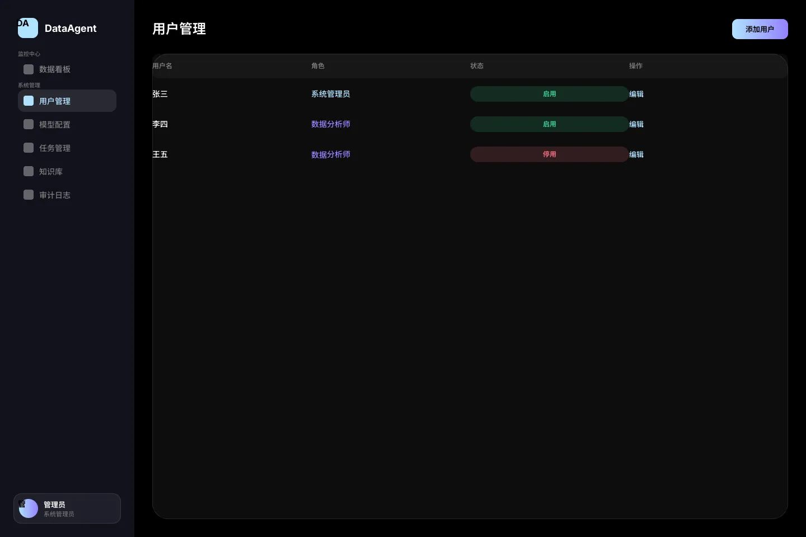

**PRD 映射**: F-15 任务管理 — 查看/取消/重试 Agent 任务 + 批量取消

**侧边栏**: 任务管理(高亮)

**主内容区**:
- Header: "任务管理"
- 筛选标签: 运行中(高亮, 8) / 已完成 / 失败
- 任务表格 (表头: 任务名称 / 状态 / 类型 / 发起人 / 操作)

---

### 3.10 知识库管理 (Screen 10)

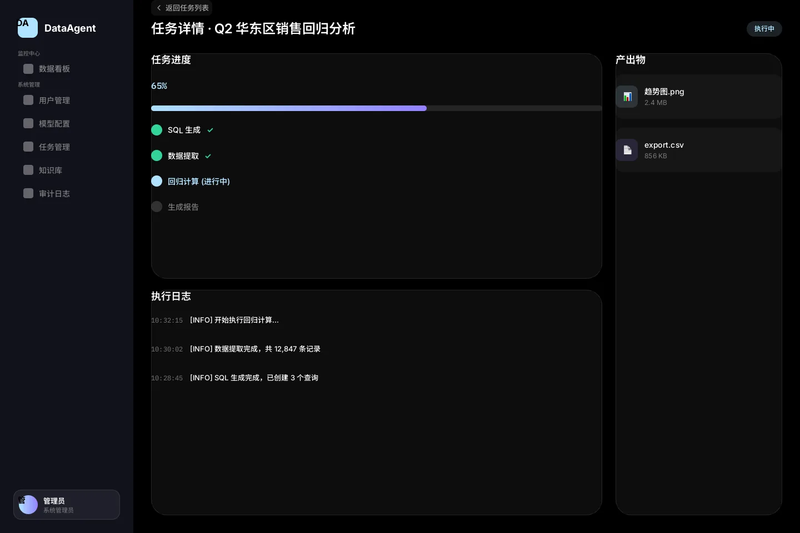

**PRD 映射**: F-08 共享知识库 — LLM 智能分片 + 异步 Agent 索引 + Skill-doc_id 绑定隔离 + 文档上传/删除、标签管理

**侧边栏**: 知识库(高亮)

**主内容区**:
- Header: "知识库管理 · LLM 索引" + 渐变"上传文档"按钮
- 索引说明条: 蓝底提示 "文档上传后由 LLM 自动分析语义段落边界并拆分索引（复用异步 Agent 任务），索引数据与文档 ID 强绑定"
- 文档卡片:
  - Q2 财务分析报告.pdf — 2.4 MB · LLM 分片: 8 chunks · 索引完成
  - 2026 市场策略.docx — 1.8 MB · LLM 分片: 6 chunks · 索引完成
  - 销售月报-2026-06.xlsx — 3.1 MB · Agent 索引中 (显示旋转动画)
  - 企业客户分级标准 v3.md — 256 KB · LLM 分片: 3 chunks · 索引完成
- 索引状态标签: [已索引 ✓] (绿色) / [索引中 ⟳] (琥珀色 + 进度动画)

---

### 3.11 审计日志 (Screen 11)

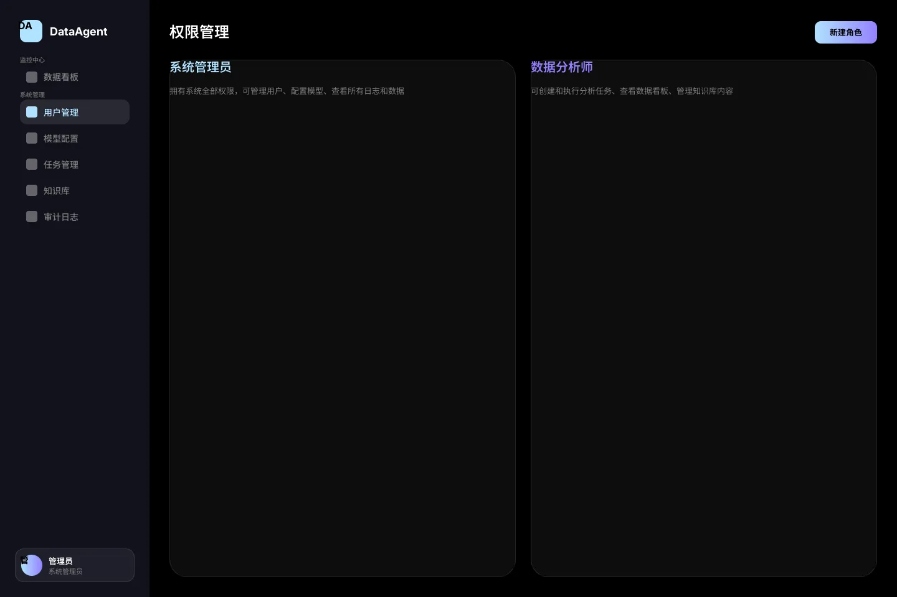

**PRD 映射**: F-12 操作审计 — 用户操作 + Agent 操作 + 安全审计，支持筛选和导出

**侧边栏**: 审计日志(高亮)

**主内容区**:
- Header: "审计日志" + "导出日志"按钮
- 审计表格 (表头: 时间 / 操作人 / 操作类型 / 详情 / IP)

| 时间 | 操作人 | 操作类型 | 详情 | IP |
|------|:---:|---------|------|------|
| 2026-07-02 10:32:15 | 张三 | Chat 查询 | 查询华东区销售额 | 10.0.23.15 |
| 2026-07-02 09:15:03 | 李四 | 知识库上传 | 上传销售月报.xlsx | 10.0.45.80 |

---

### 3.12 API 转换审核 (Screen 12)

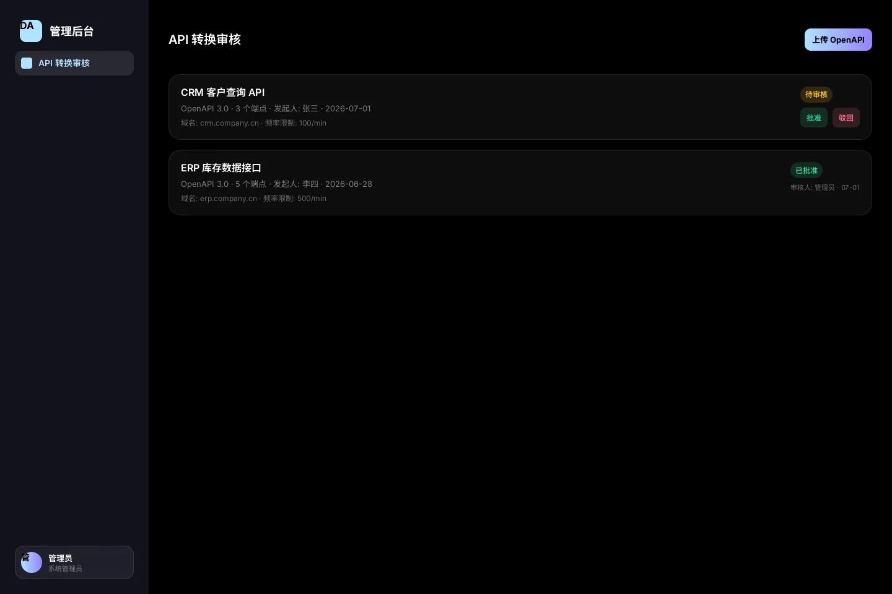

**PRD 映射**: F-10 API 转工具 — OpenAPI 3.0 导入 + 双重审核机制 + 调用频率限制

**侧边栏**: API 转换审核(高亮)

**主内容区**:
- Header: "API 转换审核" + 渐变"上传 OpenAPI"按钮
- API 卡片 1 (待审核):
  - CRM 客户查询 API
  - OpenAPI 3.0 · 3 个端点 · 发起人: 张三 · 2026-07-01
  - 域名: crm.company.cn · 频率限制: 100/min
  - 状态: [待审核] (琥珀 Pill) + 批准 / 驳回 按钮
- API 卡片 2 (已批准):
  - ERP 库存数据接口
  - OpenAPI 3.0 · 5 个端点 · 发起人: 李四 · 2026-06-28
  - 域名: erp.company.cn · 频率限制: 500/min
  - 状态: [已批准] (绿色 Pill) · 审核人: 管理员 · 07-01

---

## 4. PRD 功能覆盖检查清单

| PRD 功能 | 对应页面 | 状态 |
|---------|---------|:---:|
| F-01 数据接入 (MCP) | 数据看板 (数据源连接状态) | ✅ |
| F-02-1 SQL 统计分析 | Chat 模式、任务详情 | ✅ |
| F-02-2 高级统计(回归/聚类) | Agent 列表、任务详情 | ✅ |
| F-02-4 多维度聚合 | Agent 列表 | ✅ |
| F-03 分析结果智能解读 | Chat 模式 (AI 回复含解读) | ✅ |
| F-03-1 报告格式校验 | 任务详情 (Artifact 产出物) | ✅ |
| F-04 Chat 模式 | 轻量工作区 (含会话历史 + 消息美化渲染) | ✅ |
| F-05 Agent 模式 | 专业工作区、任务详情 | ✅ |
| F-06 定时任务 | Agent 列表 (定时任务筛选) | ✅ |
| F-07 Session 管理 | 会话历史侧边栏、用户卡片、侧边栏 | ✅ |
| F-08 共享知识库 | 知识库管理 (含 LLM 索引状态 + doc_id 隔离) | ✅ |
| F-09 邮件发送 | 任务详情 (通知机制) | ✅ |
| F-10 API 转工具 | API 转换审核 | ✅ |
| F-11 认证权限 | 登录页、权限管理 | ✅ |
| F-12 操作审计 | 审计日志 | ✅ |
| F-13 安全审查 | 审计日志 (安全审计类型) | ✅ |
| F-15 管理后台 | 全部后台页面 (7 项) + Token/产出/ROI 看板 | ✅ |
| F-17 Artifact 管理 | 任务详情 (产出物列表) | ✅ |
| F-18 增强提示词 | 轻量工作区 (✨ 增强按钮 + 建议面板) | ✅ |

---

## 5. Apple 设计原则应用

| 原则 | 应用方式 |
|------|---------|
| **慷慨留白** | 卡片内边距 20-28px，元素间距 16-24px，文本距边缘 ≥ 12px |
| **清晰层级** | 页面标题 20px → 卡片标题 18px → 正文 14px → 标签 12px，字重递减 |
| **圆角一致性** | 大卡片 28px，中等元素 12-16px，小标签 8-13px |
| **内容优先** | 深色背景让数据内容成为焦点，减少装饰元素 |
| **动态反馈** | 实时 Badge 呼吸灯、进度条动画、状态颜色变化 |
| **玻璃材质** | 半透明卡片 + 微妙边框 + 深度阴影，模拟物理空间感 |

---

## 6. 图表可视化说明

| 图表类型 | 用途 | 所在页面 |
|---------|------|---------|
| **折线/面积图** | Agent 调用量趋势 (时间序列) | 数据看板 |
| **堆叠柱状图** | Token 消耗趋势 (按模型聚合) | 数据看板 |
| **分组柱状图** | 产出统计 (报告/图表/导出 本周趋势) | 数据看板 |
| **双轴图表** | AI Agent ROI (AI 成本 vs 等效人时节省) | 数据看板 |
| **柱状图** | 各类型任务耗时分布 (P50/P95) | 数据看板 |
| **渐变柱状图** | 24h 请求量分布 | 数据看板 |
| **面积图** | 成功率趋势 (7天) | 数据看板 |
| **状态分布列表** | 任务状态占比 (已完成/执行中/排队/失败) | 数据看板 |
| **进度条** | 任务执行百分比 | 任务详情 |
| **步骤指示器** | 多步分析流程可视化 | 任务详情 |
