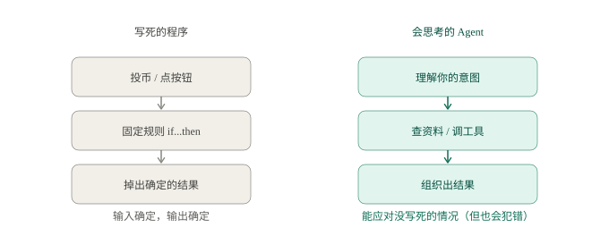
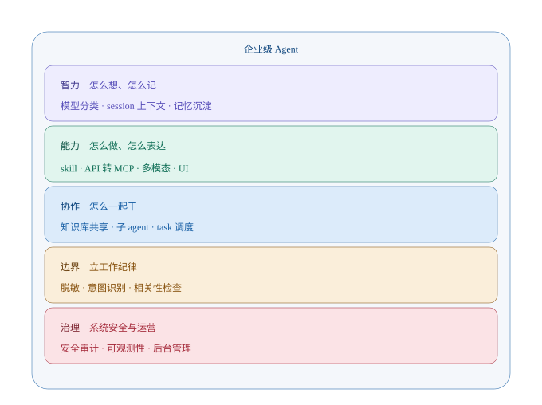

# 第 1 章　从「写死的程序」到「会思考的 Agent」

> 样章（定调稿）。全书的核心比喻，就藏在这一章里。

---

## 一台自动售货机，和一个新来的实习生

想象两个东西。

一个是**自动售货机**。你投一枚硬币，按下「可乐」的按钮，它一定会掉出一罐可乐。你投十次，它掉十次，一次都不会错。它不思考、不犹豫、不会累，也不会有情绪——因为它的每一根线路，都是工程师提前「写死」的。

另一个是**新来的实习生**。你走到他工位前说：「帮我整理一下上季度的销售数据，做个汇报。」他会先愣一下，然后问你一连串问题：数据在哪？用什么格式？汇报给谁看？重点是什么？等你回答完，他可能还会做错——漏了两列、用错了口径、甚至自作主张加了一段你觉得不该加的分析。

现在问你一个问题：**你更愿意把「整理销售数据」这件事，交给谁？**

答案几乎一定是那个实习生。哪怕他会犯错，哪怕你要来回交代好几遍。因为「整理数据做汇报」这件事，**根本没有办法被提前写死**——数据长什么样你不知道，汇报对象想要什么你不知道，什么叫「重点」更是因人而异。

**这就是 Agent 存在的全部理由。**

---

## 传统程序：把世界「写死」

过去几十年，我们写的程序，本质都是那台自动售货机。

它的逻辑是确定的：**如果……那么……**。输入确定，输出就确定。代码写得越多，售货机的货架越满、按钮越多，但它依然是一台售货机——它只能应对那些你**提前想到**的情况。

一旦世界超出了你写的规则——比如用户输入了一句你没想到的问法，数据里出现了一个你没想到的字段——它要么报错，要么给出一个驴唇不对马嘴的结果。

问题在于：**真实世界是没法被「写死」的。** 用户会问什么，数据会变成什么样，需求会怎么变，没人能提前穷举。

我们一直缺一个东西：一个**不需要你把它「写死」，也能把事情办成**的程序。

---

## 大模型：一个聪明绝顶、但还没长全的新人

大语言模型（LLM）的出现，补上了最关键的一块拼图——**理解**。

你不再需要把「整理销售数据」翻译成一堆 `if/else`。你直接用大白话说一句，它就能听懂你的意思，并且自己组织出一段像模像样的回复。它像极了一个**聪明绝顶的新人**：脑子快、知识广、什么话题都能接上几句。

但你很快就发现，这个新人的「本事」还没长全——他有超强的大脑，但记性、手脚、分寸，都还是空白：

- **记性，还是空白。** 你跟它说了十件事，转头它就忘了第九件。每次对话都像第一次见面。
- **手脚，还没长出来。** 它特别能「说」，但一件事都「做」不了——它查不了你的数据库、发不了邮件、改不了文件。
- **分寸，还没学会。** 它不知道公司里哪些数据能看、哪些不能碰，也不知道自己说的到底是不是真的。它「一本正经地胡说八道」起来，比谁都理直气壮。
- **耐心和边界，都还没立起来。** 你让它做一件要跑十分钟的活，它恨不得当场给你「编」一个结果，而不是真的去干。

一句话：**它有一个能考 140 分的大脑，但要把这份聪明，长成一个能胜任工作的「人」，还有一段路要走。**

---

## Agent：让高潜力的新人，长成靠谱的骨干

Agent 这个词，翻译过来就是「代理人」「智能体」。但我觉得最贴切的翻译是——**「一个被系统化培养过的同事」**。

Agent 做的事情，本质上就是让那个「聪明、但还没长全」的模型，把本事一样样长出来：

| 它要长出的本事 | 我们怎么帮它长出来 | 对应模块 |
|---|---|---|
| 一副好记性 | 给它配「工作日志」和「交接文档」 | **记忆 / 上下文** |
| 一双能干的手 | 给它配「电脑」和「工具」 | **工具调用** |
| 看得懂公司的家底 | 给它配「公司的知识资产」 | **知识库（RAG）** |
| 一个人也能调度千军万马 | 给它配「同事」和「主管」 | **多 Agent 协作** |
| 一套立身的规矩 | 给它配「工作纪律」（约束模型）和「权限」（系统安全） | **边界 + 治理** |
| 让干过的事都看得见 | 给它配「工作考核」——进度管理、成果汇报、项目和人力监督 | **可观测性** |

所以，**Agent 不是一个「更强的模型」，而是一套「让模型变得靠谱的系统」。**

这个认知，是全书最重要的一句话。很多人一上来就去追最新的模型、调最长的提示词，却忽略了真正决定一个企业级 agent 能不能用的，是模型**外面**那一圈工程化的设计。

---

## 企业级的「难」，不在模型，在巧思

现在，把「帮实习生整理一份数据」，放大成「帮一家企业干活」。

你会发现，事情的性质变了。一个 demo 级的 agent，让模型接个工具、查个库、回个话，一个下午就能跑起来。但一个**企业级**的 agent，要面对的是这些：

- 一百个人同时用，会不会互相干扰？
- 一个任务要跑十分钟，用户等不等得了？
- 模型中途崩了、说错话了，系统会不会跟着一起崩？
- 企业的商业秘密、客户的个人隐私，怎么保证不被模型「不小心」说给别人听？
- 三个月后，你还记得当初这段对话到底发生了什么吗？
- Token 是要花钱的，对话越长越贵，谁来买单？

这些问题，**没有一个能被「换一个更强的模型」解决。** 它们靠的是一堆看起来不起眼、但极其精妙的小设计——我把它们叫作**「巧思」**。

举三个全书会反复出现的例子，你先感受一下味道：

**巧思一：先记账，再干活。**
你可能会觉得，一件事应该「先干完，再记录结果」。但企业级 agent 反着来：**先把「我要干这件事」记下来，再去干。** 这样不管中间发生什么——进程崩了、用户关了页面、网络断了——你都能从账本上还原出「当时到底发生了什么」。账，永远比活先落。

**巧思二：两本账。**
给用户看的那本账，要**事无巨细**，每一条消息、每一次工具调用都要留痕，这样出了事能追查；但给模型看的那本账，要**高度精简**，只留最关键的结论，因为模型读得越多越贵、越慢、越糊涂。同一件事，两本账，各司其职。

**巧思三：一个人干不完，就分工。**
你不会让一个实习生同时当「客服」「财务」「法务」。企业级 agent 也一样：有人负责「跟你好好聊天」，有人负责「在后台统筹调度」，有人负责「在专业领域拿主意」。三个角色，各管一摊，互相配合。

这些巧思，光看名字平平无奇，但每一个背后都藏着一堆血泪踩坑。而它们，正是这本书要带你看的东西。

---

## 这本书，会带你走一条什么样的路

我们不妨把「开发一个企业级 agent」，想象成「把一个新人培养成团队里最靠谱的骨干」。这本书就是那份培养手册，一共分五个部分：

1. **先看懂它的智力**——它怎么「想」、怎么「记」（模型分类、上下文管理、记忆沉淀）；
2. **再给它装上能力**——它怎么把事「做成、说清」（skill、API 转 MCP、多模态、UI 与飞书 IM）；
3. **然后让它学会协作**——它怎么和「别的 agent、别的活、共享的知识、以及人」配合（知识库、子 agent、task 调度、人机协作）；
4. **接着给它立一套工作纪律**——守口如瓶、先想清楚再干、只专注最要紧的事（脱敏、意图识别、相关性检查，外加关键动作前的人复核）；
5. **最后把系统级的事管起来**——安全、权限、进度与成果的监督、运营（安全审计、可观测性、后台管理）。

你不需要会写代码。你只需要带着一个朴素的问题出发：

**「如果它是一个人，我该怎么帮它长成一个靠谱的骨干？」**

带着这个问题，我们开始。全书要搭建的，就是下面这幅「五层」的地图：

---

> 本章配图（已产出，存于 assets/）：
> - 图 1-1　示意图：fig-1-1-program-vs-agent.svg
> - 图 1-2　示意图：fig-1-2-book-map.svg
> - 图 1-3　插画：fig-1-3-new-colleague.png
